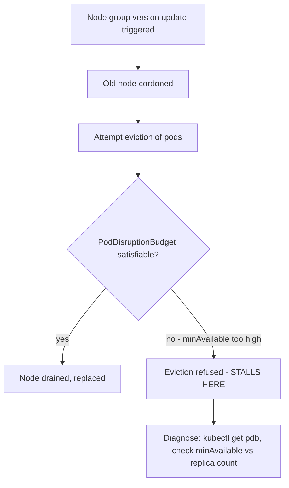

# Lab 4: Managed Node Groups

## Objective
Trigger a managed node group version update, deliberately stall it with a misconfigured `PodDisruptionBudget`, diagnose the stall, and fix it — reproducing the exact drain-blocking pattern that catches most teams by surprise the first time.

## Scenario
A routine node group AMI update should replace old nodes with new ones, paced and safe. Instead, it stalls at 60% complete. This lab reproduces the stall on purpose so you learn to diagnose it from the actual symptoms, not just read about the cause.

## Skills Practised
- Managed node group version updates and their drain-respecting rollout behavior
- Diagnosing a stalled rollout via `PodDisruptionBudget` inspection
- The correct upgrade sequencing (control plane → EKS add-ons → self-managed add-ons → nodes)
- Taints/tolerations for dedicated node pools

## Architecture


## Prerequisites
- A running EKS cluster with a managed node group of at least 3 nodes (per [Lab 1](../lab-01-cluster-bootstrap/))

## Directory Structure
```text
lab-04-managed-node-groups/
├── README.md
├── manifests/
│   ├── single-replica-with-strict-pdb.yaml
│   └── gpu-nodepool-taint-demo.yaml
└── scripts/diagnose-stalled-drain.sh
```

## Step-by-Step Tasks
1. Apply `manifests/single-replica-with-strict-pdb.yaml` — a single-replica Deployment with a `PodDisruptionBudget` requiring `minAvailable: 1`, an unsatisfiable combination for any eviction attempt.
2. Cordon and attempt to drain the node this pod lands on: `kubectl drain <node> --ignore-daemonsets`.
3. Observe the drain hangs, never completing.
4. Run `scripts/diagnose-stalled-drain.sh` to identify the specific blocking PDB.
5. Fix it: either scale the Deployment to 2+ replicas, or adjust the PDB, then re-attempt the drain and confirm it now completes.
6. Uncordon the node when done.

## Kubernetes Configuration
See [`manifests/`](manifests/) and [`scripts/diagnose-stalled-drain.sh`](scripts/diagnose-stalled-drain.sh).

## Commands to Execute
```bash
kubectl apply -f manifests/single-replica-with-strict-pdb.yaml
NODE=$(kubectl get pod -l app=single-replica-app -o jsonpath='{.items[0].spec.nodeName}')
kubectl cordon $NODE
kubectl drain $NODE --ignore-daemonsets --timeout=30s   # will time out / hang
./scripts/diagnose-stalled-drain.sh
```

## Expected Output
- `kubectl drain` times out or hangs, unable to evict the single-replica pod.
- The diagnostic script identifies the specific PDB (`minAvailable: 1` against a 1-replica Deployment) as the blocker.

## Validation
```bash
kubectl get pdb single-replica-pdb -o jsonpath='{.status.currentHealthy} {.status.desiredHealthy}'
```
Shows `1 1` — confirming the PDB genuinely cannot be satisfied by any eviction.

## Failure Injection
This lab's entire structure **is** the failure injection — the strict PDB is deliberately unsatisfiable to reproduce [Question 37](../../interview-questions/04-node-management.md#question-37-the-managed-node-group-stuck-mid-update).

## Troubleshooting Exercise
Fix the PDB by scaling the Deployment to 2 replicas instead of adjusting the PDB itself, and confirm the drain now succeeds — then revert to 1 replica and instead relax the PDB (`minAvailable: 0`), confirming this is also a valid fix. Discuss which fix is more appropriate depending on whether the availability requirement or the replica count was the actual mistake.

## Cleanup
```bash
kubectl uncordon $NODE
kubectl delete -f manifests/single-replica-with-strict-pdb.yaml
```
**Chargeable resources:** none beyond the already-running node group.

## Interview Questions Connected to This Lab
- [Question 37: The managed node group stuck mid-update](../../interview-questions/04-node-management.md#question-37-the-managed-node-group-stuck-mid-update)
- [Question 5: The upgrade that skipped a step](../../interview-questions/01-eks-cluster-architecture.md#question-5-the-upgrade-that-skipped-a-step)
- [Question 55: The taint nobody remembered to add](../../interview-questions/06-autoscaling-scheduling.md#question-55-the-taint-nobody-remembered-to-add)

## Production Considerations
- Before any real node group update, proactively audit every PDB in the cluster for internal consistency against current replica counts — this exact stall is entirely preventable.
- See `manifests/gpu-nodepool-taint-demo.yaml` for the taint/toleration pattern reserving expensive node capacity — relevant when this node group represents a dedicated pool, per Question 55.

## Advanced Challenge
Write a pre-upgrade validation script checking every PDB in the cluster against its target Deployment/StatefulSet's current replica count, flagging any combination where `minAvailable` (or `maxUnavailable`) would make eviction structurally impossible — the automated check this lab's manual diagnosis exercise is a stand-in for.
