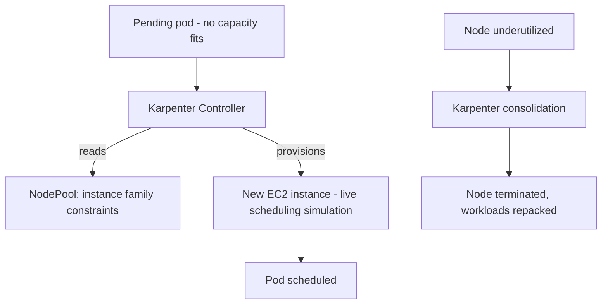

# Lab 5: Karpenter Autoscaling

## Objective
Install Karpenter, configure a `NodePool`/`EC2NodeClass`, trigger a scale-out from a pending pod, observe consolidation reclaim underutilized capacity, and reproduce the HPA/Karpenter oscillation trap from tuning timing too aggressively.

## Scenario
Your cluster currently runs a static managed node group sized for peak load year-round, wasting money during quiet periods, and a GPU workload's pod has been stuck `Pending` for a week with nobody noticing why. You've been asked to replace the static node group with Karpenter, and to diagnose the stuck GPU pod as your first real test of the new setup.

## Skills Practised
- Installing Karpenter via Helm with IRSA-scoped permissions
- `NodePool`/`EC2NodeClass` configuration (instance families, taints, disruption settings)
- Observing consolidation reclaim underutilized nodes
- Diagnosing an unsatisfiable `NodePool` constraint (a pending pod with no matching instance family)
- Tuning HPA/Karpenter timing to avoid oscillation

## Architecture


## Prerequisites
- A running EKS cluster (per [Lab 1](../lab-01-cluster-bootstrap/)) with IRSA available (per [Lab 3](../lab-03-irsa-and-iam/))
- Helm >= 3.12

## Directory Structure
```text
lab-05-karpenter-autoscaling/
├── README.md
├── helm/karpenter-values.yaml
├── manifests/
│   ├── nodepool-general.yaml
│   ├── nodepool-gpu-unsatisfiable.yaml
│   └── scale-out-test-deployment.yaml
```

## Step-by-Step Tasks
1. Install Karpenter via Helm, using an IRSA-scoped role (per [Lab 3](../lab-03-irsa-and-iam/)) with permissions to launch/terminate EC2 instances.
2. Apply `manifests/nodepool-general.yaml` — a general-purpose `NodePool` permitting `m5`/`m6i` instance families.
3. Apply `manifests/scale-out-test-deployment.yaml` scaled to a replica count exceeding current cluster capacity, and observe Karpenter provisioning new nodes within seconds.
4. Scale the deployment back down to near-zero and observe Karpenter's consolidation reclaiming the now-underutilized nodes after the configured `consolidateAfter` delay.
5. Apply `manifests/nodepool-gpu-unsatisfiable.yaml`'s companion pending pod (referencing a GPU resource with no matching `NodePool`) and confirm it stays `Pending` indefinitely with Karpenter correctly taking no action — reproducing [Question 36](../../interview-questions/04-node-management.md#question-36-the-karpenter-nodepool-that-never-matched).

## Kubernetes Configuration
See [`helm/karpenter-values.yaml`](helm/karpenter-values.yaml) and [`manifests/`](manifests/).

## Commands to Execute
```bash
helm repo add karpenter https://charts.karpenter.sh
helm upgrade --install karpenter karpenter/karpenter -n karpenter --create-namespace -f helm/karpenter-values.yaml
kubectl apply -f manifests/nodepool-general.yaml
kubectl apply -f manifests/scale-out-test-deployment.yaml
kubectl scale deployment scale-out-test --replicas=20
kubectl get nodes -w   # watch new nodes appear
kubectl scale deployment scale-out-test --replicas=1
# wait for consolidateAfter delay, then:
kubectl get nodes -w   # watch nodes get reclaimed
```

## Expected Output
- New nodes appear within roughly 1-2 minutes of the scale-out, sized to fit the pending pods' actual resource requests.
- After scaling down, underutilized nodes are consolidated (terminated) after the configured delay, with workloads repacked onto fewer nodes first.
- The GPU-requiring pending pod remains `Pending` indefinitely, with `kubectl describe pod` showing no matching `NodePool`, and Karpenter's own logs showing no provisioning attempt for it.

## Validation
```bash
kubectl get nodeclaims   # Karpenter's own record of every node it has provisioned
kubectl logs -n karpenter deployment/karpenter -f | grep -i "launching\|consolidat"
```

## Failure Injection
Set `consolidateAfter` to an aggressive, very short value (e.g., `30s`) alongside an HPA with a short `stabilizationWindowSeconds`, and generate an oscillating load pattern (a script alternating replica count every minute) — observe near-constant node churn, reproducing [Question 41](../../interview-questions/06-autoscaling-scheduling.md#question-41-hpa-and-karpenter-fighting-in-slow-motion). Lengthen both timings and confirm the churn subsides.

## Troubleshooting Exercise
Configure a second `NodePool` with no taint, alongside a GPU `NodePool` that IS tainted, and confirm non-GPU workloads never land on the (tainted) GPU nodes — then remove the taint and confirm they do, reproducing [Question 55](../../interview-questions/06-autoscaling-scheduling.md#question-55-the-taint-nobody-remembered-to-add)'s exact mechanism.

## Cleanup
```bash
kubectl delete -f manifests/
helm uninstall karpenter -n karpenter
```
**Chargeable resources:** every node Karpenter provisions during this lab — monitor `kubectl get nodes` throughout and don't leave a scaled-out state running unattended.

## Interview Questions Connected to This Lab
- [Question 36: The Karpenter NodePool that never matched](../../interview-questions/04-node-management.md#question-36-the-karpenter-nodepool-that-never-matched)
- [Question 41: HPA and Karpenter, fighting in slow motion](../../interview-questions/06-autoscaling-scheduling.md#question-41-hpa-and-karpenter-fighting-in-slow-motion)
- [Question 55: The taint that scheduled nothing](../../interview-questions/06-autoscaling-scheduling.md#question-55-the-taint-nobody-remembered-to-add)

## Production Considerations
- Real production `NodePool` design should include explicit `limits` (a cost ceiling) to prevent unbounded scale-out from a runaway workload.
- Spot instance handling (Question 35) requires the AWS Node Termination Handler or Karpenter's native interruption handling — not exercised in this lab's basic setup; see the Advanced Challenge.

## Advanced Challenge
Add a Spot-capacity `NodePool` and a workload with a `PodDisruptionBudget`, then use the AWS Fault Injection Simulator (or manually terminate a Spot instance via the console) to simulate an interruption — confirm graceful draining occurs and no in-flight requests are dropped, reproducing [Question 35](../../interview-questions/04-node-management.md#question-35-the-spot-interruption-nobody-handled-gracefully).
