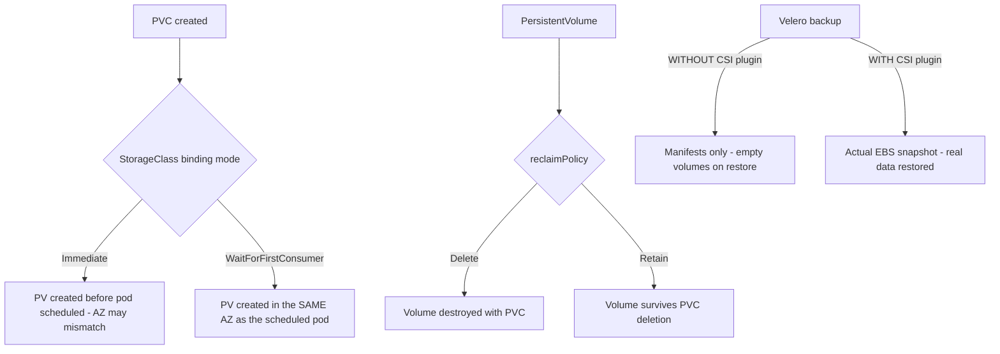

# Lab 6: Storage — EBS/EFS CSI

## Objective
Reproduce the EBS zonal-affinity scheduling trap with `WaitForFirstConsumer`, compare `Delete` vs. `Retain` reclaim policy behavior directly, and validate a genuine Velero backup-and-restore cycle including actual data, not just manifests.

## Scenario
A stateful workload keeps getting stuck `ContainerCreating` after node replacements, and a recent database-adjacent incident revealed that your team's Velero backups have never actually been restore-tested — nobody knows if they'd genuinely recover data in an emergency. This lab reproduces both problems on purpose so you can fix them with confidence before either becomes a real incident.

## Skills Practised
- `StorageClass` binding modes (`Immediate` vs. `WaitForFirstConsumer`) and their AZ-scheduling implications
- Reclaim policy (`Delete` vs. `Retain`) — observed directly, not just described
- EFS for genuine `ReadWriteMany` multi-pod access
- Velero backup/restore including the CSI snapshot plugin (real data recovery, not just manifest recovery)

## Architecture


## Prerequisites
- A running EKS cluster with the EBS CSI driver installed (per [Lab 1](../lab-01-cluster-bootstrap/)'s add-on checklist)
- Velero CLI installed, with an S3 bucket for backup storage

## Directory Structure
```text
lab-06-storage-ebs-efs-csi/
├── README.md
├── manifests/
│   ├── storageclass-immediate-vs-wffc.yaml
│   ├── storageclass-delete-vs-retain.yaml
│   └── statefulset-with-data.yaml
└── scripts/velero-backup-restore-test.sh
```

## Step-by-Step Tasks
1. Apply `manifests/storageclass-immediate-vs-wffc.yaml`'s `Immediate`-mode PVC and deliberately schedule a pod using it onto a node in a *different* AZ (via node affinity) — observe the pod stuck unable to attach.
2. Repeat with the `WaitForFirstConsumer`-mode StorageClass and confirm the PV is correctly created in the scheduled pod's actual AZ.
3. Apply `manifests/storageclass-delete-vs-retain.yaml`'s two StorageClasses, create a PVC under each, delete both PVCs, and confirm via `kubectl get pv` that the `Delete`-policy volume is gone while the `Retain`-policy volume persists (orphaned).
4. Deploy `manifests/statefulset-with-data.yaml` and write real, identifiable data into its volume.
5. Run `scripts/velero-backup-restore-test.sh` — first **without** the CSI plugin enabled, confirming a restore produces an empty volume; then **with** it enabled, confirming the actual data is restored.

## Kubernetes Configuration
See [`manifests/`](manifests/) and [`scripts/velero-backup-restore-test.sh`](scripts/velero-backup-restore-test.sh).

## Commands to Execute
```bash
kubectl apply -f manifests/storageclass-immediate-vs-wffc.yaml
kubectl apply -f manifests/storageclass-delete-vs-retain.yaml
kubectl apply -f manifests/statefulset-with-data.yaml
kubectl exec statefulset-with-data-0 -- sh -c 'echo "lab06-test-data" > /data/testfile.txt'
./scripts/velero-backup-restore-test.sh
```

## Expected Output
- `Immediate` mode + cross-AZ scheduling: pod stuck `ContainerCreating` with a volume-attach error.
- `WaitForFirstConsumer` mode: pod schedules and mounts successfully every time.
- `Delete` PV: gone after PVC deletion. `Retain` PV: still present, in `Released` status, orphaned.
- Velero restore without CSI plugin: volume exists but is empty (no `testfile.txt`). With CSI plugin: `testfile.txt` is present with its original content.

## Validation
```bash
kubectl exec statefulset-with-data-0-restored -- cat /data/testfile.txt
```
Should print `lab06-test-data` only for the CSI-plugin-enabled restore.

## Failure Injection
This lab's entire structure **is** the failure-injection exercise for AZ mismatch (Question 43) and the reclaim-policy comparison (Question 45).

## Troubleshooting Exercise
Attempt to change a StatefulSet's `volumeClaimTemplates` in place (edit the StorageClass reference directly) and observe the immutability error — then follow the correct migration process (new StatefulSet, explicit data migration, cutover) instead of working around the error, reproducing [Question 49](../../interview-questions/05-storage-stateful.md#question-49-the-statefulset-upgrade-that-ate-its-own-volume).

## Cleanup
```bash
kubectl delete -f manifests/
velero backup delete lab06-test-backup --confirm
```
**Chargeable resources:** EBS volumes and their snapshots — confirm all are deleted, since orphaned `Retain`-policy volumes and snapshots continue billing indefinitely.

## Interview Questions Connected to This Lab
- [Question 43: The pod that couldn't follow its volume](../../interview-questions/05-storage-stateful.md#question-43-the-pod-that-couldnt-follow-its-volume)
- [Question 45: Delete versus Retain, chosen wrong in both directions](../../interview-questions/05-storage-stateful.md#question-45-delete-versus-retain-chosen-wrong-in-both-directions)
- [Question 47: The Velero restore that came back empty](../../interview-questions/05-storage-stateful.md#question-47-the-velero-restore-that-came-back-empty)

## Production Considerations
- Standardize on `WaitForFirstConsumer` for every EBS-backed StorageClass fleet-wide — see [`docs/storage.md`](../../docs/storage.md) §2.
- Periodic, actual restore-testing (not just backup-job-success monitoring) is the only way to know your backup strategy genuinely works — a backup job reporting "success" only confirms the backup process ran without erroring.

## Advanced Challenge
Add an EFS-backed PVC with `ReadWriteMany` access mode, mount it from two pods simultaneously, and confirm both can read/write concurrently — something the EBS-backed volumes in this lab structurally cannot do.
