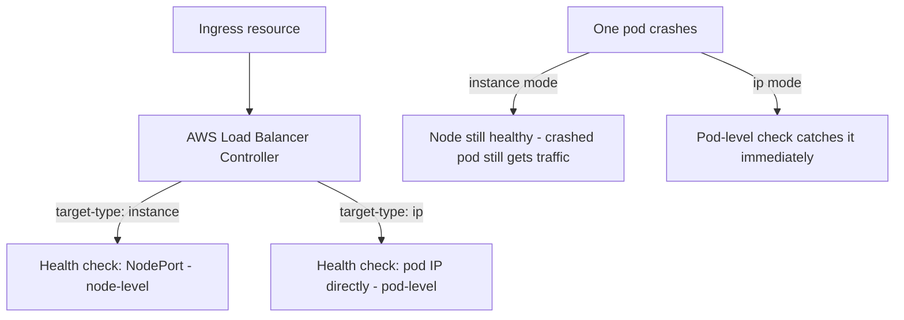

# Lab 7: Ingress and Load Balancing

## Objective
Install the AWS Load Balancer Controller, provision an ALB via Ingress, directly compare `instance` vs. `ip` target-type health-check behavior under a simulated pod failure, and reproduce an IngressGroup path-conflict.

## Scenario
Users occasionally report brief errors right after a deployment, even though your health checks look fine — and separately, two teams sharing one ALB just discovered their paths silently conflict. You've been asked to diagnose both, using this lab's reproducible setup rather than guessing from production symptoms.

## Skills Practised
- Installing the AWS Load Balancer Controller with IRSA
- `target-type: instance` vs. `ip` and their different health-check granularity
- `IngressGroup` path-conflict diagnosis via rendered ALB listener rules
- NLB for a Layer 4 workload vs. ALB for Layer 7

## Architecture


## Prerequisites
- A running EKS cluster with IRSA (per [Lab 3](../lab-03-irsa-and-iam/))
- Helm >= 3.12

## Directory Structure
```text
lab-07-ingress-and-load-balancing/
├── README.md
├── helm/aws-load-balancer-controller-values.yaml
└── manifests/
    ├── ingress-instance-mode.yaml
    ├── ingress-ip-mode.yaml
    ├── ingress-group-conflict.yaml
    └── app-with-crash-endpoint.yaml
```

## Step-by-Step Tasks
1. Install the AWS Load Balancer Controller via Helm with an IRSA-scoped role.
2. Deploy `manifests/app-with-crash-endpoint.yaml` (an app with a `/crash` endpoint killing the process) alongside `manifests/ingress-instance-mode.yaml`.
3. Trigger a crash on one replica (`curl <alb-dns>/crash`) and observe requests still occasionally route to the crashed pod's node before Kubernetes fully reschedules it — `instance` mode's health check doesn't catch this immediately.
4. Switch to `manifests/ingress-ip-mode.yaml` and repeat — observe the target group marks the specific failed pod unhealthy immediately, correctly routing around it.
5. Apply `manifests/ingress-group-conflict.yaml` (two Ingress resources with overlapping paths on the same `IngressGroup`) and inspect the actual rendered ALB listener rules in the AWS console to see which one silently wins.

## Kubernetes Configuration
See [`helm/`](helm/) and [`manifests/`](manifests/).

## Commands to Execute
```bash
helm repo add eks https://aws.github.io/eks-charts
helm upgrade --install aws-load-balancer-controller eks/aws-load-balancer-controller \
  -n kube-system -f helm/aws-load-balancer-controller-values.yaml
kubectl apply -f manifests/app-with-crash-endpoint.yaml
kubectl apply -f manifests/ingress-instance-mode.yaml
ALB_DNS=$(kubectl get ingress app-ingress-instance -o jsonpath='{.status.loadBalancer.ingress[0].hostname}')
curl http://$ALB_DNS/crash
```

## Expected Output
- `instance` mode: some requests still reach the crashed pod's node briefly after the crash, since the health check reflects node/NodePort reachability, not the specific pod's health.
- `ip` mode: the target group marks the crashed pod's IP unhealthy directly and quickly, routing around it correctly.
- The `IngressGroup` conflict: one path's backend silently wins based on rule priority, not either team's stated intent.

## Validation
```bash
aws elbv2 describe-target-health --target-group-arn $(aws elbv2 describe-target-groups --query "TargetGroups[?contains(TargetGroupArn, 'ip-mode')].TargetGroupArn" --output text)
```

## Failure Injection
This lab's entire structure **is** the failure-injection exercise for [Question 12](../../interview-questions/02-networking.md#question-12-the-health-check-that-lied) (target-type health-check granularity) and [Question 17](../../interview-questions/02-networking.md#question-17-the-ingress-that-routed-to-the-wrong-version) (IngressGroup path conflict).

## Troubleshooting Exercise
Add explicit `alb.ingress.kubernetes.io/group.order` annotations to both conflicting Ingress resources, resolving the ambiguity deterministically — confirm the intended path ownership now wins consistently, not by chance.

## Cleanup
```bash
kubectl delete -f manifests/
helm uninstall aws-load-balancer-controller -n kube-system
```
**Chargeable resources:** the provisioned ALB(s) — verify deletion in the AWS console after `kubectl delete`, since a stuck finalizer can occasionally leave one behind.

## Interview Questions Connected to This Lab
- [Question 12: The health check that lied](../../interview-questions/02-networking.md#question-12-the-health-check-that-lied)
- [Question 17: The Ingress that routed to the wrong version](../../interview-questions/02-networking.md#question-17-the-ingress-that-routed-to-the-wrong-version)
- [Question 18: Layer 4 or Layer 7?](../../interview-questions/02-networking.md#question-18-layer-4-or-layer-7)

## Production Considerations
- Standardize on `target-type: ip` as the default for every new Ingress in a VPC-CNI cluster — reserve `instance` mode only for the rare CNI plugin that doesn't support `ip` mode.
- Establish an organizational path-namespacing convention (each team owns a distinct top-level path prefix) before multiple teams start sharing one `IngressGroup`.

## Advanced Challenge
Provision an NLB-backed Service for a simulated gRPC workload (`service.beta.kubernetes.io/aws-load-balancer-type: nlb`) alongside the ALB-backed REST API from this lab, and compare their respective health-check and connection-handling behavior under the same simulated pod-crash test.
