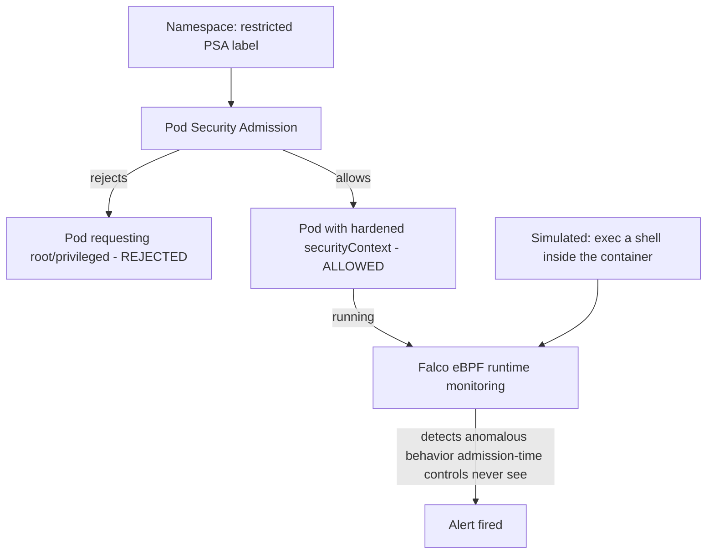

# Lab 8: Security Hardening

## Objective
Apply Pod Security Admission at the `restricted` level, verify it actually rejects a deliberately non-compliant pod, harden a workload's `securityContext` across all five defense-in-depth layers, and install Falco to catch a simulated runtime compromise.

## Scenario
A new namespace was created without anyone remembering to apply Pod Security Admission labels, and a recent tabletop exercise revealed nobody actually knows whether your admission controls would catch a genuinely compromised, already-running container. This lab builds both the missing guardrail and the runtime-detection layer admission control structurally can't provide.

## Skills Practised
- Pod Security Admission labels and their enforce/audit/warn modes
- Full `securityContext` hardening (`runAsNonRoot`, dropped capabilities, `seccompProfile`)
- Falco runtime security — detecting behavior admission-time controls structurally cannot see
- The five-layer defense-in-depth model (IAM/IRSA, RBAC, PSA, NetworkPolicy, container hardening)

## Architecture


## Prerequisites
- A running EKS cluster (per [Lab 1](../lab-01-cluster-bootstrap/))
- Helm >= 3.12 for Falco installation

## Directory Structure
```text
lab-08-security-hardening/
├── README.md
├── manifests/
│   ├── namespace-restricted-psa.yaml
│   ├── pod-noncompliant.yaml
│   └── pod-hardened.yaml
├── helm/falco-values.yaml
└── scripts/simulate-runtime-compromise.sh
```

## Step-by-Step Tasks
1. Apply `manifests/namespace-restricted-psa.yaml` — a namespace labeled `pod-security.kubernetes.io/enforce: restricted`.
2. Attempt to apply `manifests/pod-noncompliant.yaml` (runs as root, no dropped capabilities) into that namespace and confirm it's rejected immediately, with the specific PSA violation named in the error.
3. Apply `manifests/pod-hardened.yaml` (full `securityContext`: `runAsNonRoot`, `allowPrivilegeEscalation: false`, all capabilities dropped, `seccompProfile: RuntimeDefault`) and confirm it's accepted.
4. Install Falco via Helm.
5. Run `scripts/simulate-runtime-compromise.sh` (execs a shell inside the hardened pod, simulating a post-admission compromise) and confirm Falco fires an alert — something admission control structurally cannot do, since the pod was already legitimately running.

## Kubernetes Configuration
See [`manifests/`](manifests/) and [`helm/falco-values.yaml`](helm/falco-values.yaml).

## Commands to Execute
```bash
kubectl apply -f manifests/namespace-restricted-psa.yaml
kubectl apply -f manifests/pod-noncompliant.yaml   # expect: rejected
kubectl apply -f manifests/pod-hardened.yaml        # expect: accepted
helm repo add falcosecurity https://falcosecurity.github.io/charts
helm upgrade --install falco falcosecurity/falco -n falco --create-namespace -f helm/falco-values.yaml
./scripts/simulate-runtime-compromise.sh
kubectl logs -n falco -l app.kubernetes.io/name=falco --tail=20
```

## Expected Output
- `pod-noncompliant.yaml` fails admission with a clear PSA violation message, before the pod object is even created.
- `pod-hardened.yaml` is accepted and runs successfully.
- After the simulated compromise, Falco's logs show a detected anomalous-shell-spawn event within seconds.

## Validation
```bash
kubectl get pod pod-hardened -n restricted-test -o jsonpath='{.spec.securityContext}'
kubectl logs -n falco -l app.kubernetes.io/name=falco | grep -i "shell\|spawned"
```

## Failure Injection
This lab's entire structure **is** the failure-injection exercise for [Question 61](../../interview-questions/07-security-hardening.md#question-61-the-namespace-that-forgot-to-lock-its-doors) (missing PSA label) and [Question 65](../../interview-questions/07-security-hardening.md#question-65-the-runtime-anomaly-admission-control-never-sees) (the runtime-vs-admission gap).

## Troubleshooting Exercise
Remove the PSA label from the namespace entirely and re-apply `pod-noncompliant.yaml` — confirm it's now accepted with no enforcement at all, silently, exactly reproducing [Question 61](../../interview-questions/07-security-hardening.md#question-61-the-namespace-that-forgot-to-lock-its-doors)'s "namespace that forgot to lock its doors."

## Cleanup
```bash
kubectl delete -f manifests/
helm uninstall falco -n falco
```
**Chargeable resources:** none beyond the already-running cluster.

## Interview Questions Connected to This Lab
- [Question 61: The namespace that forgot to lock its doors](../../interview-questions/07-security-hardening.md#question-61-the-namespace-that-forgot-to-lock-its-doors)
- [Question 65: The runtime anomaly admission control never sees](../../interview-questions/07-security-hardening.md#question-65-the-runtime-anomaly-admission-control-never-sees)
- [Question 66: Least privilege, checked at every layer but one](../../interview-questions/07-security-hardening.md#question-66-least-privilege-checked-at-every-layer-but-one)

## Production Considerations
- Bake PSA labels into the standard namespace-creation GitOps template — never create a namespace without them (see [Lab 10](../lab-10-gitops-argocd/) and [Question 68](../../interview-questions/07-security-hardening.md#question-68-the-security-baseline-that-only-existed-in-one-cluster)).
- Tune Falco's ruleset against your organization's actual legitimate behavior before relying on it — an untuned ruleset produces excessive false positives that erode trust in the alerting.

## Advanced Challenge
Add a Kyverno `verifyImages` policy (per [Lab 13](../lab-13-policy-as-code-opa/)) requiring a valid Cosign signature before any pod using this lab's hardened `securityContext` pattern can be admitted — combining image-supply-chain verification with runtime/admission hardening into one complete pipeline.
