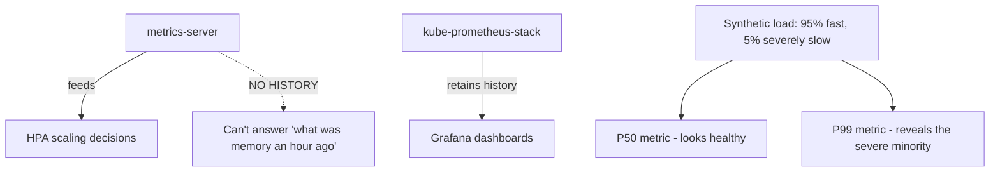

# Lab 9: Observability Stack

## Objective
Install `kube-prometheus-stack`, prove `metrics-server` alone retains no history (closing the exact gap from Question 79), and reproduce the P50-masks-a-severe-minority-issue statistics trap with a real, generated traffic pattern.

## Scenario
A postmortem needs to answer "what did memory usage look like an hour before the incident" and your team discovers `metrics-server` alone can't answer that at all — and separately, a dashboard showing healthy P50 latency completely missed a severe issue affecting 5% of real users. This lab builds the observability stack that closes both gaps, and proves the gap existed in the first place.

## Skills Practised
- Distinguishing `metrics-server` (HPA-feed only, no history) from genuine observability
- PromQL for percentile-based latency queries (P50 vs. P99)
- NodeLocal DNSCache installation and CoreDNS load reduction, measured
- Alert design: symptom-based vs. per-event (reproducing the alert-fatigue trap)

## Architecture


## Prerequisites
- A running EKS cluster (per [Lab 1](../lab-01-cluster-bootstrap/))
- Helm >= 3.12

## Directory Structure
```text
lab-09-observability-stack/
├── README.md
├── helm/kube-prometheus-stack-values.yaml
├── manifests/
│   ├── latency-simulator-deployment.yaml
│   └── p99-alert-rule.yaml
└── scripts/
    ├── generate-mixed-latency-load.sh
    └── compare-metrics-server-vs-prometheus.sh
```

## Step-by-Step Tasks
1. Install `metrics-server` only (if not already present) and confirm `kubectl top pods` works.
2. Run `scripts/compare-metrics-server-vs-prometheus.sh` — attempt to query memory usage from an hour ago via `metrics-server`'s API and confirm it's simply not possible.
3. Install `kube-prometheus-stack` via Helm.
4. Deploy `manifests/latency-simulator-deployment.yaml` (an app where 5% of requests are deliberately very slow, 95% fast).
5. Run `scripts/generate-mixed-latency-load.sh` to generate sustained traffic against it.
6. In Grafana (or via `kubectl exec` into a pod with `promtool`/`curl` against Prometheus directly), query P50 latency — observe it looks healthy, masking the severe 5%.
7. Query P99 latency and observe it clearly reveals the severe minority issue P50 missed entirely.
8. Apply `manifests/p99-alert-rule.yaml` and confirm it would have caught this issue P50-only alerting never would.

## Kubernetes Configuration
See [`helm/kube-prometheus-stack-values.yaml`](helm/kube-prometheus-stack-values.yaml), [`manifests/`](manifests/), and [`scripts/`](scripts/).

## Commands to Execute
```bash
helm repo add prometheus-community https://prometheus-community.github.io/helm-charts
helm upgrade --install kube-prometheus-stack prometheus-community/kube-prometheus-stack \
  -n monitoring --create-namespace -f helm/kube-prometheus-stack-values.yaml
kubectl apply -f manifests/latency-simulator-deployment.yaml
./scripts/generate-mixed-latency-load.sh
```

## Expected Output
- `metrics-server` API queries for historical data return nothing — only current values.
- P50 query result: comfortably low, "healthy-looking."
- P99 query result: clearly elevated, revealing the severe 5% the P50 metric completely masked.

## Validation
```promql
histogram_quantile(0.50, rate(http_request_duration_seconds_bucket[5m]))
histogram_quantile(0.99, rate(http_request_duration_seconds_bucket[5m]))
```
Compare the two values directly — the gap between them is the entire lesson of [Question 83](../../interview-questions/09-observability.md#question-83-the-dashboard-that-lied-by-omission).

## Failure Injection
This lab's entire structure **is** the failure-injection exercise for the P50-masking trap.

## Troubleshooting Exercise
Install NodeLocal DNSCache, generate high DNS query volume against CoreDNS (a script performing rapid repeated lookups from many pods), and compare CoreDNS's own CPU/request-rate metrics before and after — quantifying [Question 15](../../interview-questions/02-networking.md#question-15-the-dns-resolver-that-couldnt-keep-up)'s fix directly in Grafana.

## Cleanup
```bash
kubectl delete -f manifests/
helm uninstall kube-prometheus-stack -n monitoring
```
**Chargeable resources:** none beyond the already-running cluster (Prometheus's own storage uses cluster-local EBS via its PVC — clean that up too if provisioned).

## Interview Questions Connected to This Lab
- [Question 79: The autoscaling that had no history](../../interview-questions/09-observability.md#question-79-the-autoscaling-that-had-no-history)
- [Question 83: The dashboard that lied by omission](../../interview-questions/09-observability.md#question-83-the-dashboard-that-lied-by-omission)
- [Question 80: The alert that fired four hundred times before anyone looked](../../interview-questions/09-observability.md#question-80-the-alert-that-fired-four-hundred-times-before-anyone-looked)

## Production Considerations
- Choose P99 (or P95/P90 as intermediate signals) alongside P50 for every genuinely important service's alerting — never rely on a single central-tendency statistic.
- Balance CloudWatch Container Insights' fast time-to-value against a self-managed Prometheus stack's cost efficiency at scale — many organizations run both for different purposes.

## Advanced Challenge
Add OpenTelemetry instrumentation to the latency-simulator app and correlate a specific slow trace against the P99 spike, walking the full metrics-then-logs-then-traces correlation sequence from [Question 84](../../interview-questions/09-observability.md#question-84-correlating-three-signals-during-a-live-incident).
