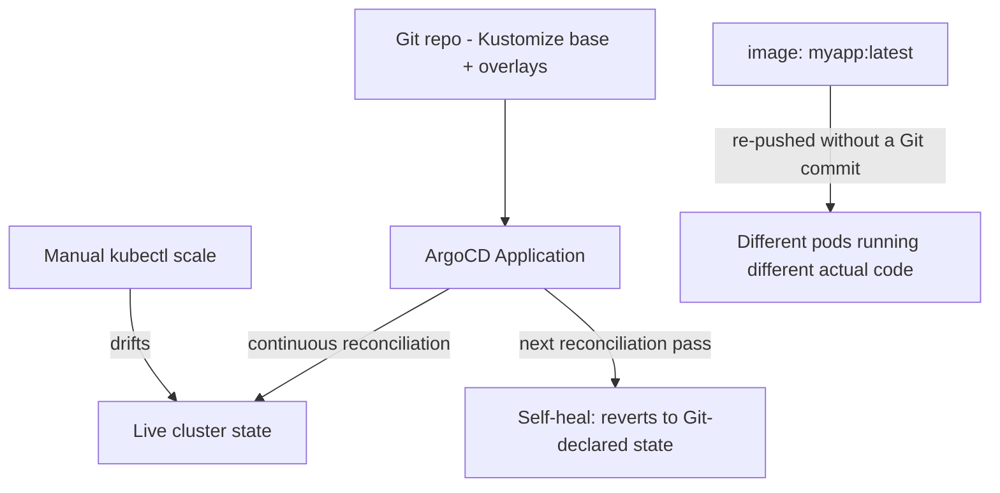

# Lab 10: GitOps with ArgoCD

## Objective
Install ArgoCD, deploy an application via a Git-sourced `Application`, prove self-healing by manually drifting live state, and reproduce the mutable-tag version-consistency gap directly.

## Scenario
An on-call engineer, handling an active incident, ran `kubectl scale` directly against a GitOps-managed Deployment during a traffic spike — and watched it silently revert two minutes later, with no idea why. This lab reproduces that exact confusion on purpose, then shows the actually-correct emergency-response action within a GitOps-managed system.

## Skills Practised
- ArgoCD `Application` resources and sync policy (`automated`, `selfHeal`, `prune`)
- Self-healing drift correction, observed directly
- The Git-declares-spec vs. controller-tracks-status distinction
- The `:latest` mutable-tag trap and its fix via immutable digest references

## Architecture


## Prerequisites
- A running EKS cluster (per [Lab 1](../lab-01-cluster-bootstrap/))
- A Git repository you can push to (a personal fork of this lab's `gitops-repo/` subdirectory, or any Git host)

## Directory Structure
```text
lab-10-gitops-argocd/
├── README.md
├── gitops-repo/
│   ├── base/deployment.yaml
│   └── overlays/dev/kustomization.yaml
└── argocd-application.yaml
```

## Step-by-Step Tasks
1. Install ArgoCD via the standard manifest.
2. Push `gitops-repo/` to your own Git repository.
3. Apply `argocd-application.yaml` (pointed at your repo) and confirm ArgoCD syncs the Deployment automatically.
4. Run `kubectl scale deployment gitops-demo-app --replicas=10` directly (bypassing Git) and watch ArgoCD's next reconciliation pass revert it back to Git's declared replica count — self-healing, observed directly.
5. Change the Deployment's image tag in the base manifest to `myapp:latest`, commit, and let ArgoCD sync. Then simulate a new image being pushed under the same `latest` tag (conceptually — no Git change) and discuss why ArgoCD's "Synced" status provides no guarantee about which actual image content is running.
6. Fix it: change to an immutable, specific tag/digest reference, commit, and confirm every pod now consistently runs the exact same image.

## Kubernetes Configuration
See [`gitops-repo/`](gitops-repo/) and [`argocd-application.yaml`](argocd-application.yaml).

## Commands to Execute
```bash
kubectl create namespace argocd
kubectl apply -n argocd -f https://raw.githubusercontent.com/argoproj/argo-cd/stable/manifests/install.yaml
kubectl apply -f argocd-application.yaml
kubectl scale deployment gitops-demo-app --replicas=10
sleep 60
kubectl get deployment gitops-demo-app -o jsonpath='{.spec.replicas}'  # should be back to Git's value
```

## Expected Output
- ArgoCD syncs the application within seconds of the `Application` resource being applied.
- The manual `kubectl scale` to 10 replicas is reverted back to Git's declared value on ArgoCD's next reconciliation pass (typically within 3 minutes, or immediately if you trigger a manual sync).

## Validation
```bash
argocd app get gitops-demo-app
kubectl get deployment gitops-demo-app -o jsonpath='{.spec.replicas}'
```

## Failure Injection
This lab's entire structure **is** the failure-injection exercise for [Question 87](../../interview-questions/10-cicd-gitops.md#question-87-the-kubectl-apply-that-fought-the-gitops-controller) (self-healing reverting a manual "emergency" change) and [Question 93](../../interview-questions/10-cicd-gitops.md#question-93-the-image-tag-that-meant-something-different-every-time) (mutable tag inconsistency).

## Troubleshooting Exercise
Instead of `kubectl scale` directly, make the emergency change the **correct** way — commit the replica-count change to Git and push, confirming ArgoCD reconciles toward it and *maintains* it (unlike the manual change, which got reverted). This is the actual correct incident-response action per Question 87.

## Cleanup
```bash
kubectl delete -f argocd-application.yaml
kubectl delete namespace argocd
```
**Chargeable resources:** none beyond the already-running cluster.

## Interview Questions Connected to This Lab
- [Question 87: The kubectl apply that fought the GitOps controller](../../interview-questions/10-cicd-gitops.md#question-87-the-kubectl-apply-that-fought-the-gitops-controller)
- [Question 93: The image tag that meant something different every time](../../interview-questions/10-cicd-gitops.md#question-93-the-image-tag-that-meant-something-different-every-time)
- [Question 92: The Rollout's own state that Git didn't fully describe](../../interview-questions/10-cicd-gitops.md#question-92-the-rollouts-own-state-that-git-didnt-fully-describe)

## Production Considerations
- Never use `:latest` (or any mutable tag) in a GitOps-managed manifest — enforce this via a Kyverno policy (see [Lab 13](../lab-13-policy-as-code-opa/)).
- Real emergency changes should always go through Git, even under time pressure — see the Troubleshooting Exercise above for the correct pattern.

## Advanced Challenge
Set up an `ApplicationSet` with a cluster generator targeting two clusters (or two namespaces simulating two clusters), and confirm both receive identical configuration from the same Git source — then deliberately fail to register the second "cluster," reproducing [Question 96](../../interview-questions/10-cicd-gitops.md#question-96-the-multi-cluster-app-of-apps-that-only-remembered-one-cluster)'s silent-registration-gap.
