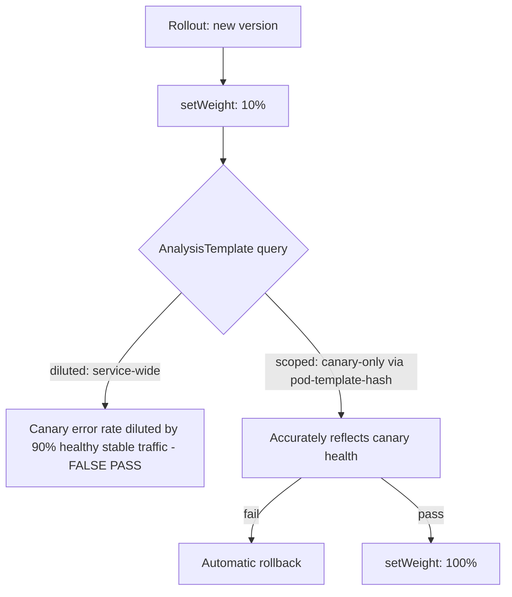

# Lab 11: Progressive Delivery

## Objective
Install Argo Rollouts, run a canary deployment with an `AnalysisTemplate`, deliberately misconfigure the analysis query to be diluted by stable traffic, then fix it — reproducing the exact "canary passed but was actually broken" trap.

## Scenario
A canary deployment "passed" its automated analysis and promoted to 100% traffic — only for the new version to turn out genuinely broken, having been serving errors the entire time. This lab reproduces the exact measurement flaw that let this happen, then fixes it.

## Skills Practised
- Argo Rollouts `Rollout` resource replacing a standard `Deployment`
- Canary steps with `setWeight` and `pause`
- `AnalysisTemplate` PromQL scoping — canary-specific vs. service-wide (diluted) queries
- Manual promotion gates (`pause: {}` with no duration) vs. automated, duration-based pauses

## Architecture


## Prerequisites
- A running EKS cluster with `kube-prometheus-stack` installed (per [Lab 9](../lab-09-observability-stack/))

## Directory Structure
```text
lab-11-progressive-delivery/
├── README.md
└── manifests/
    ├── rollout-with-diluted-analysis.yaml
    ├── rollout-with-scoped-analysis.yaml
    └── broken-canary-image-deployment.yaml
```

## Step-by-Step Tasks
1. Install Argo Rollouts via the standard manifest.
2. Apply `manifests/rollout-with-diluted-analysis.yaml` — a Rollout whose `AnalysisTemplate` queries error rate **service-wide**, not scoped to the canary specifically.
3. Trigger a rollout to a deliberately broken image (`manifests/broken-canary-image-deployment.yaml`, returning 500s for its own traffic) and watch the diluted analysis **pass anyway** (since 90%+ of traffic is still the healthy stable version).
4. Confirm the broken version gets promoted to 100% despite being genuinely broken — the exact failure from [Question 89](../../interview-questions/10-cicd-gitops.md#question-89-the-analysistemplate-that-measured-the-wrong-thing).
5. Roll back manually, fix the `AnalysisTemplate` to use `manifests/rollout-with-scoped-analysis.yaml`'s canary-scoped query (filtering on `rollouts-pod-template-hash`), and re-trigger the same broken rollout.
6. Confirm this time the scoped analysis correctly fails and automatically rolls back before any meaningful traffic reaches the broken version.

## Kubernetes Configuration
See [`manifests/`](manifests/).

## Commands to Execute
```bash
kubectl create namespace argo-rollouts
kubectl apply -n argo-rollouts -f https://github.com/argoproj/argo-rollouts/releases/latest/download/install.yaml
kubectl apply -f manifests/rollout-with-diluted-analysis.yaml
kubectl argo rollouts set image canary-demo canary-demo=broken-image:v2
kubectl argo rollouts get rollout canary-demo --watch
```

## Expected Output
- With the diluted query: the AnalysisRun shows "Successful" despite the canary genuinely serving errors — a false pass.
- With the scoped query: the AnalysisRun correctly shows "Failed," and the Rollout automatically aborts and rolls back to the previous stable version.

## Validation
```bash
kubectl argo rollouts get rollout canary-demo
kubectl get analysisrun -o wide
```

## Failure Injection
This lab's entire structure **is** the failure-injection exercise for [Question 89](../../interview-questions/10-cicd-gitops.md#question-89-the-analysistemplate-that-measured-the-wrong-thing).

## Troubleshooting Exercise
Change one canary step to `pause: {}` with no duration (a manual gate) instead of a time-based pause, trigger a rollout, and confirm it stalls indefinitely at that step until you manually run `kubectl argo rollouts promote canary-demo` — reproducing [Question 88](../../interview-questions/10-cicd-gitops.md#question-88-the-canary-that-never-got-promoted)'s exact "stalled, not broken" scenario.

## Cleanup
```bash
kubectl delete -f manifests/
kubectl delete namespace argo-rollouts
```
**Chargeable resources:** none beyond the already-running cluster.

## Interview Questions Connected to This Lab
- [Question 88: The canary that never got promoted](../../interview-questions/10-cicd-gitops.md#question-88-the-canary-that-never-got-promoted)
- [Question 89: The AnalysisTemplate that measured the wrong thing](../../interview-questions/10-cicd-gitops.md#question-89-the-analysistemplate-that-measured-the-wrong-thing)
- [Question 92: The Rollout's own state that Git didn't fully describe](../../interview-questions/10-cicd-gitops.md#question-92-the-rollouts-own-state-that-git-didnt-fully-describe)

## Production Considerations
- Always validate a new `AnalysisTemplate` against a deliberately-broken test canary in non-production before trusting it for real production rollouts.
- Document which Rollout steps are automated vs. manually-gated for every application, and alert on a rollout paused-for-approval longer than an expected threshold.

## Advanced Challenge
Add a blue-green `Rollout` strategy (instead of canary) for a second demo application, and compare its all-or-nothing cutover-with-instant-rollback-capability against canary's gradual, traffic-weighted approach.
