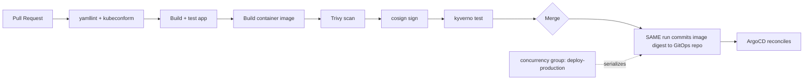

# Lab 12: CI/CD Pipeline

## Objective
Build a complete GitHub Actions pipeline for Kubernetes manifests: lint → build/scan/sign → policy test → render → commit-to-GitOps-repo → ArgoCD reconciles — and reproduce the exact race condition that pairs a validated manifest with the wrong image.

## Scenario
Your team's current pipeline builds an image and updates the GitOps repo in two separate, unsynchronized steps, occasionally racing under concurrent commits. This lab builds the correct, race-free pipeline and demonstrates why the naive version fails.

## Skills Practised
- The full GitOps-era CI pipeline: build/scan/sign the image, render manifests, commit to the GitOps repo (not apply directly)
- `cosign` image signing and Kyverno `verifyImages` policy checking
- Concurrency-safe pipeline design preventing the artifact-identity race from Question 95
- `kyverno test`/policy testing as a pre-merge CI gate

## Architecture


## Prerequisites
- A GitHub repository (fork/clone this lab directory)
- ArgoCD installed (per [Lab 10](../lab-10-gitops-argocd/))
- `cosign` installed locally for testing signing

## Directory Structure
```text
lab-12-cicd-pipeline/
├── README.md
├── .github/workflows/build-and-deploy.yml
├── policies/require-signed-images.yaml
└── manifests/app-deployment-template.yaml
```

## Step-by-Step Tasks
1. Review `.github/workflows/build-and-deploy.yml` — note the `concurrency` group on the deploy job, and that the build/sign/commit sequence happens within a **single** job run, using the digest computed in that same run.
2. Review `policies/require-signed-images.yaml` — a Kyverno policy requiring a valid cosign signature before admission.
3. Push a test commit and watch the pipeline: lint → build → scan → sign → policy test → commit digest to the GitOps repo → ArgoCD syncs.
4. Deliberately push an unsigned image directly (bypassing the pipeline) and confirm the Kyverno policy rejects it at admission time.
5. Simulate the race condition manually: trigger two pipeline runs in quick succession without the `concurrency` group present (temporarily remove it), and observe how interleaved runs could produce a mismatched manifest/image pairing — then restore the `concurrency` group.

## Kubernetes Configuration
See [`.github/workflows/build-and-deploy.yml`](.github/workflows/build-and-deploy.yml) and [`policies/require-signed-images.yaml`](policies/require-signed-images.yaml).

## Commands to Execute
```bash
kubectl apply -f policies/require-signed-images.yaml   # install Kyverno first if not already present
git commit -am "test change" && git push
gh run watch
```

## Expected Output
- A full pipeline run completes with the image signed and its specific digest committed to the GitOps repo, which ArgoCD then reconciles.
- An unsigned image manually applied is rejected by Kyverno with a clear signature-verification failure.

## Validation
```bash
kubectl get events -A --field-selector reason=PolicyViolation
cosign verify --key cosign.pub my-registry/my-app@sha256:...
```

## Failure Injection
Temporarily remove the `concurrency` block from the deploy job and manually trigger two workflow runs simultaneously (`gh workflow run` twice) — observe both attempting to commit to the GitOps repo concurrently, risking exactly the artifact-identity mismatch from [Question 95](../../interview-questions/10-cicd-gitops.md#question-95-the-pipeline-that-tested-the-wrong-artifact). Restore the `concurrency` block.

## Troubleshooting Exercise
Set the Kyverno policy's `validationFailureAction` to `Audit` instead of `Enforce`, push an unsigned image, and confirm it's now merely logged, not blocked — reproducing [Question 64](../../interview-questions/07-security-hardening.md#question-64-the-signature-nobody-checked)'s "signed but never verified" gap. Restore `Enforce`.

## Cleanup
```bash
kubectl delete -f policies/
```
**Chargeable resources:** none beyond the already-running cluster and any container registry storage costs.

## Interview Questions Connected to This Lab
- [Question 95: The pipeline that tested the wrong artifact](../../interview-questions/10-cicd-gitops.md#question-95-the-pipeline-that-tested-the-wrong-artifact)
- [Question 64: The signature nobody checked](../../interview-questions/07-security-hardening.md#question-64-the-signature-nobody-checked)
- [Question 63: The image that passed the scan but not the audit](../../interview-questions/07-security-hardening.md#question-63-the-image-that-passed-the-scan-but-not-the-audit)

## Production Considerations
- Enable ECR enhanced (continuous) scanning so a newly-disclosed CVE against an already-deployed image is caught, not just at build time — see Question 63.
- Establish a documented severity-based SLA for responding to newly-flagged vulnerabilities in already-running images.

## Advanced Challenge
Add SLSA provenance attestation (via `cosign attest`) alongside the basic signature, and extend the Kyverno policy to verify the attestation's specific claims (source commit, build system identity) — reproducing [Question 67](../../interview-questions/07-security-hardening.md#question-67-the-compliance-requirement-that-outran-the-policy-engine)'s stronger provenance requirement.
