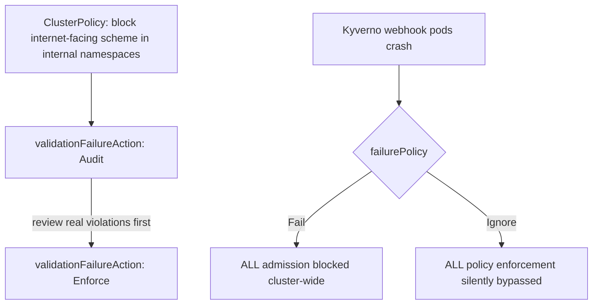

# Lab 13: Policy as Code (OPA/Gatekeeper)

## Objective
Install Kyverno, roll out a policy in audit mode first, promote it to enforcement, and deliberately break the policy engine itself to observe the `failurePolicy: Fail` vs. `Ignore` trade-off directly.

## Scenario
A security review needs proof that your admission policies are genuinely enforced, not just present — and separately, your team has never actually discussed what happens to the whole cluster if the policy engine itself goes down. This lab builds a real policy with a proper audit-then-enforce rollout, and forces the `failurePolicy` trade-off into the open before an actual outage does.

## Skills Practised
- Kyverno `ClusterPolicy` with `validationFailureAction: Audit` vs. `Enforce`
- The audit-mode-first rollout discipline
- `failurePolicy` trade-offs — availability vs. security when the policy engine itself is down
- `kyverno test` for policy unit testing

## Architecture


## Prerequisites
- A running EKS cluster (per [Lab 1](../lab-01-cluster-bootstrap/))
- Helm >= 3.12

## Directory Structure
```text
lab-13-policy-as-code-opa/
├── README.md
├── helm/kyverno-values.yaml
├── policies/
│   ├── block-internal-facing-scheme.yaml
│   └── tests/
│       ├── kyverno-test.yaml
│       ├── good-service.yaml
│       └── bad-service.yaml
└── manifests/internal-namespace.yaml
```

## Step-by-Step Tasks
1. Install Kyverno via Helm.
2. Run `kyverno test policies/tests/` locally — confirm the policy correctly passes `good-service.yaml` and fails `bad-service.yaml` **before** ever applying it to a live cluster.
3. Apply `policies/block-internal-facing-scheme.yaml` with `validationFailureAction: Audit` first.
4. Apply `manifests/internal-namespace.yaml` and `policies/tests/bad-service.yaml` (an internet-facing Service in an internal-only namespace) and confirm it's **allowed** but flagged in Kyverno's policy report — audit mode, not blocking yet.
5. Review the policy report, confirm no unexpected legitimate traffic would be blocked, then switch to `validationFailureAction: Enforce`.
6. Re-apply the same bad Service and confirm it's now genuinely rejected.
7. Simulate a Kyverno outage (`kubectl scale deployment kyverno-admission-controller -n kyverno --replicas=0`) with `failurePolicy: Fail` set, and confirm **every** admission-controlled operation now blocks cluster-wide — then switch to `failurePolicy: Ignore` and confirm the opposite: everything is silently allowed through unchecked.

## Kubernetes Configuration
See [`helm/kyverno-values.yaml`](helm/kyverno-values.yaml), [`policies/`](policies/), and [`manifests/`](manifests/).

## Commands to Execute
```bash
helm repo add kyverno https://kyverno.github.io/kyverno/
helm upgrade --install kyverno kyverno/kyverno -n kyverno --create-namespace -f helm/kyverno-values.yaml
kyverno test policies/tests/
kubectl apply -f manifests/internal-namespace.yaml
kubectl apply -f policies/block-internal-facing-scheme.yaml
kubectl apply -f policies/tests/bad-service.yaml -n internal-only   # audit mode: allowed, flagged
```

## Expected Output
- `kyverno test` passes both fixtures correctly before any live application.
- In audit mode: the bad Service is created but flagged in `kubectl get polr` (PolicyReport).
- In enforce mode: the bad Service is rejected outright.
- With `failurePolicy: Fail` and Kyverno down: any new Pod/Service creation cluster-wide fails.
- With `failurePolicy: Ignore` and Kyverno down: everything is admitted, policy silently bypassed.

## Validation
```bash
kubectl get polr -A   # PolicyReport - audit mode findings
kubectl apply -f policies/tests/bad-service.yaml -n internal-only   # after Enforce: expect rejection
```

## Failure Injection
Step 7 above **is** the failure-injection exercise for [Question 115](../../interview-questions/14-governance-policy.md#question-115-the-policy-that-blocked-its-own-emergency-fix) (an emergency needing a bypass) and the broader `failurePolicy` trade-off from [`docs/governance-policy.md`](../../docs/governance-policy.md) §2.

## Troubleshooting Exercise
Create a scoped `PolicyException` (per Kyverno's `PolicyException` resource) allowing one specific, labeled exception to bypass this policy, and confirm it works narrowly — only for resources matching the exception's specific condition, not a blanket bypass — reproducing the correct fix for [Question 115](../../interview-questions/14-governance-policy.md#question-115-the-policy-that-blocked-its-own-emergency-fix).

## Cleanup
```bash
kubectl delete -f policies/
kubectl delete -f manifests/
helm uninstall kyverno -n kyverno
```
**Chargeable resources:** none beyond the already-running cluster.

## Interview Questions Connected to This Lab
- [Question 115: The policy that blocked its own emergency fix](../../interview-questions/14-governance-policy.md#question-115-the-policy-that-blocked-its-own-emergency-fix)
- [Question 116: The policy that passed in CI but failed in the cluster](../../interview-questions/14-governance-policy.md#question-116-the-policy-that-passed-in-ci-but-failed-in-the-cluster)
- [Question 21: The internal service that leaked externally](../../interview-questions/02-networking.md#question-21-the-internal-service-that-leaked-externally)

## Production Considerations
- Ensure CI's `kyverno test` fixtures are sourced from the **same** repository/path the live cluster's GitOps controller reconciles from — never a separately-maintained copy that can silently drift (Question 116).
- Reserve `failurePolicy: Fail` for genuinely critical policies where a bypass is worse than an outage; use `Ignore` (with monitoring) for lower-stakes policies.

## Advanced Challenge
Consolidate this lab's policy alongside two or three others from [Lab 8](../lab-08-security-hardening/) into one centrally-managed policy repository, deployed via an `ApplicationSet` (per [Lab 10](../lab-10-gitops-argocd/)) applying identically to multiple simulated "clusters" (namespaces), reproducing [Question 117](../../interview-questions/14-governance-policy.md#question-117-one-policy-set-twenty-clusters-twenty-opinions)'s consolidation fix.
