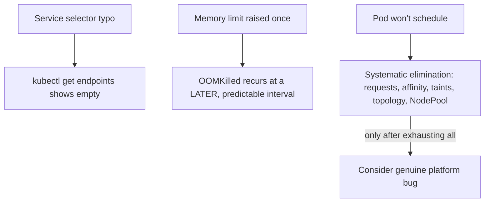

# Lab 14: Troubleshooting and Recovery

## Objective
Reproduce and diagnose five real EKS troubleshooting patterns hands-on: a Service with zero endpoints, a memory leak recurring after a limit increase, an overly-broad rescue-equivalent (an incorrectly-scoped runtime policy), a scheduler-blamed-instead-of-config-blamed incident, and a multi-symptom incident requiring separated investigation.

## Scenario
On-call for a week, you hit several genuinely confusing symptoms. This lab reproduces each in a safe, disposable namespace so you build the actual diagnostic muscle memory, not just read about it.

## Skills Practised
- Diagnosing a Service matching zero endpoints via label-selector mismatch
- Distinguishing a genuine memory leak from a one-time undersized limit
- The systematic "rule out configuration before blaming the scheduler" checklist
- Multi-symptom incident investigation: verifying shared-cause vs. independent-cause

## Architecture


## Prerequisites
- A running EKS cluster (per [Lab 1](../lab-01-cluster-bootstrap/)), ideally with Karpenter (per [Lab 5](../lab-05-karpenter-autoscaling/))

## Directory Structure
```text
lab-14-troubleshooting-and-recovery/
├── README.md
├── manifests/
│   ├── zero-endpoint-service.yaml
│   ├── memory-leak-simulator.yaml
│   └── unschedulable-pod-checklist-demo.yaml
└── scripts/
    ├── diagnose-zero-endpoints.sh
    └── diagnose-unschedulable-pod.sh
```

## Step-by-Step Tasks

### Scenario 1: The Service that matched zero endpoints
1. Apply `manifests/zero-endpoint-service.yaml` — a Service whose selector doesn't match its intended Deployment's labels (a deliberate typo).
2. Run `scripts/diagnose-zero-endpoints.sh` and confirm it identifies the exact selector/label mismatch.
3. Fix the selector and confirm endpoints populate correctly.

### Scenario 2: The OOMKilled that recurred at a predictable interval
1. Apply `manifests/memory-leak-simulator.yaml` (a container that allocates memory at a steady rate and never releases it) with a memory limit.
2. Observe it gets OOMKilled after some time; raise the limit once, "fixing" it temporarily.
3. Observe it gets OOMKilled again later, at a roughly predictable, longer interval — confirming this is a genuine leak, not a one-time undersized limit, per [Question 101: The fix that fixed it, until it didn't](../../interview-questions/11-troubleshooting.md#question-101-the-fix-that-fixed-it-until-it-didnt).

### Scenario 3: The unschedulable pod checklist
1. Apply `manifests/unschedulable-pod-checklist-demo.yaml` — a pod with a resource request the cluster genuinely can't satisfy.
2. Run `scripts/diagnose-unschedulable-pod.sh` — walks the full systematic checklist (requests vs. capacity, affinity, taints, topology spread, NodePool constraints) **before** concluding anything about the scheduler itself.
3. Fix the actual cause (reduce the resource request, or provision matching capacity) and confirm it schedules.

## Kubernetes Configuration
See [`manifests/`](manifests/) and [`scripts/`](scripts/).

## Commands to Execute
```bash
kubectl apply -f manifests/zero-endpoint-service.yaml
./scripts/diagnose-zero-endpoints.sh

kubectl apply -f manifests/memory-leak-simulator.yaml
kubectl get pod memory-leak-simulator -w   # watch for OOMKilled over time

kubectl apply -f manifests/unschedulable-pod-checklist-demo.yaml
./scripts/diagnose-unschedulable-pod.sh
```

## Expected Output
- Scenario 1: `kubectl get endpoints zero-endpoint-service` shows an empty `ENDPOINTS` column; the diagnostic script pinpoints the exact label mismatch.
- Scenario 2: two OOMKilled events over time, at increasing intervals matching the limit increases — the leak signature.
- Scenario 3: the diagnostic script systematically rules out each cause in order, correctly identifying the actual blocker.

## Validation
```bash
kubectl get endpoints zero-endpoint-service   # after fix: populated
kubectl describe pod unschedulable-pod-demo | grep -A5 Events   # after fix: scheduled
```

## Failure Injection
Each scenario **is** the failure-injection exercise — see Step-by-Step Tasks above for each.

## Troubleshooting Exercise
For Scenario 3, deliberately skip the systematic checklist and jump straight to "the scheduler must be broken" — then walk back through the checklist properly and find the actual, mundane cause (a resource request exceeding available capacity). Compare how much longer the "blame the platform first" approach would have taken in a real incident, reproducing [Question 103](../../interview-questions/11-ha-dr.md#question-103-the-rto-nobody-had-actually-measured) (cross-referenced) and the companion EKS repository's own postmortem-rigor Question 103.

## Cleanup
```bash
kubectl delete -f manifests/
```
**Chargeable resources:** none beyond the already-running cluster.

## Interview Questions Connected to This Lab
- [Question 101: The fix that fixed it, until it didn't](../../interview-questions/11-troubleshooting.md#question-101-the-fix-that-fixed-it-until-it-didnt) (OOMKilled recurrence — genuine leak vs. undersized limit)
- [Question 103: The postmortem that blamed the wrong layer](../../interview-questions/11-troubleshooting.md#question-103-the-postmortem-that-blamed-the-wrong-layer)
- [Question 4: OOMKilled diagnostic reasoning](../../interview-questions/01-eks-cluster-architecture.md#question-4-the-latency-spike-nobody-could-explain) — see also [`docs/troubleshooting.md`](../../docs/troubleshooting.md) §9 for the zero-endpoints runbook entry

## Production Considerations
- Add an alert on any Service with zero endpoints for more than a brief grace period — a standing guardrail against Scenario 1 recurring silently.
- Treat "does memory usage plateau, or does it show unbounded growth" as the standard diagnostic question for any OOMKilled incident recurring after a limit increase.

## Advanced Challenge
Build a single diagnostic script combining all three scenarios' checks into one standard "first response" tool for any confusing pod/Service symptom, following the systematic-elimination order established throughout this repository's troubleshooting guidance.
