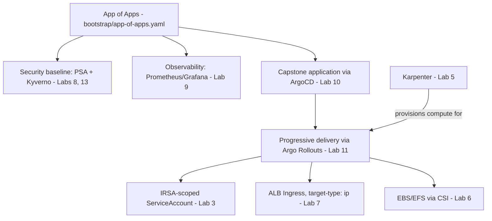

# Operations Reference — Enterprise Capstone

This document is the operational deliverable for the capstone — the kind of reference a new on-call engineer should be able to use to understand, operate, and recover this platform without needing to ask the person who built it.

## Architecture

## Cross-component dependencies

- The App of Apps pattern means **every new cluster** gets the identical security/observability baseline automatically — no manual, per-cluster bootstrap step, closing the gap from [Question 68](../../interview-questions/07-security-hardening.md#question-68-the-security-baseline-that-only-existed-in-one-cluster).
- The capstone application's ServiceAccount must have a correctly-scoped IRSA trust policy (Lab 3) — a broken trust policy fails predictably and specifically for its AWS-dependent functionality only, not the whole application.
- Progressive delivery's `AnalysisTemplate` must query metrics scoped to the canary specifically (Lab 11) — an unscoped query provides false confidence.
- The ALB's `target-type: ip` (Lab 7) ensures health checks reflect genuine pod health, not just node reachability.

## Cost considerations

This is the most expensive lab in the repository — it runs the fullest stack simultaneously:
- EKS control plane: ~$0.10/hour
- Karpenter-provisioned nodes: varies with actual workload demand
- ALB: ~$0.025/hour plus LCU charges
- Prometheus's EBS-backed storage: proportional to retention period configured in [Lab 9](../lab-09-observability-stack/)

**Tear down promptly** — this is not a lab to leave running unattended.

## Security considerations

- Every workload runs under `restricted` Pod Security Admission by default (via the bootstrapped baseline), not opt-in per application.
- Kyverno policies (image signature verification, internal-only scheme enforcement) apply cluster-wide via the same bootstrapped baseline.
- IRSA trust policies must include the `sub`/`aud` condition — see [Lab 3](../lab-03-irsa-and-iam/)'s positive-control test pattern for verifying this, not just configuring it.

## Scaling considerations

- Karpenter's `NodePool` `limits` should be reviewed against actual expected peak demand for this platform — an unbounded limit risks a runaway-cost scenario from a misbehaving workload.
- At genuinely large scale (many applications, many teams sharing this platform), consider the multi-tenant isolation model from [`diagrams/15-multi-tenant-isolation-model.md`](../../diagrams/15-multi-tenant-isolation-model.md) — dedicated node pools, per-namespace `ResourceQuota`, and NetworkPolicy default-deny between tenant namespaces.

## Disaster recovery

- The GitOps controller (ArgoCD) is itself a dependency for reconciling **new** changes — per the Troubleshooting Exercise in this lab's README, already-running workloads survive an ArgoCD outage, but nothing new can be deployed until it's restored.
- For a genuine multi-region DR design, this platform's stateful dependencies (any database, any EBS-backed data) need an explicit, separate replication mechanism — GitOps/configuration parity alone never covers data, per [Question 106](../../interview-questions/12-ha-dr.md#question-106-the-dr-cluster-that-was-ready-except-for-the-part-that-mattered).
- A DR-region deployment of this same App of Apps pattern needs its **own** ArgoCD instance, independent of the primary region's availability — per [`docs/ha-dr.md`](../../docs/ha-dr.md) §7.

## On-call runbook: common issues

| Symptom | Likely cause | Reference |
|---|---|---|
| Application's AWS calls fail with AccessDenied | IRSA trust policy misconfigured or ServiceAccount annotation missing | [Lab 3](../lab-03-irsa-and-iam/), Question 23/24 |
| Canary promotes despite being broken | `AnalysisTemplate` query not scoped to canary traffic | [Lab 11](../lab-11-progressive-delivery/), Question 89 |
| New pod rejected at admission | Violates `restricted` Pod Security Admission or a Kyverno policy | [Lab 8](../lab-08-security-hardening/), [Lab 13](../lab-13-policy-as-code-opa/) |
| ALB health checks flapping | `target-type: instance` instead of `ip`, or a genuinely unhealthy pod | [Lab 7](../lab-07-ingress-and-load-balancing/), Question 12 |
| A `kubectl` change reverts on its own | GitOps self-healing correcting drift — this is expected; commit the change to Git instead | [Lab 10](../lab-10-gitops-argocd/), Question 87 |
