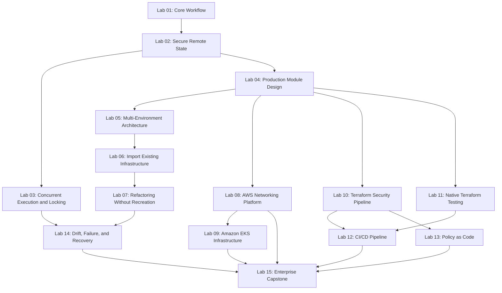

# Terraform Senior Interview Preparation

A production-grade Terraform interview preparation and hands-on learning repository for engineers targeting **Senior / Lead / Staff DevOps Engineer, Terraform Engineer, Cloud Platform Engineer, Infrastructure Architect,** and **SRE** roles.

This is not a beginner Terraform tutorial. There are no "what is a provider" questions here. Every question, lab, and diagram assumes you already run Terraform in production and is built around the failure modes, architecture trade-offs, and governance problems that actually come up at the 8–15+ year experience level.

## Who this is for

- Senior / Lead / Staff DevOps Engineers preparing for Terraform-heavy interviews
- Cloud Platform Engineers and Infrastructure Architects designing multi-account AWS estates
- SREs who own Terraform-managed production infrastructure
- Anyone who can already write a working `.tf` file and now needs to reason about state, blast radius, governance, and recovery under pressure

## What's inside

| Area | Description |
|---|---|
| [`docs/`](docs/) | Deep-dive reference documentation: architecture, internals, state, modules, security, testing, CI/CD, troubleshooting, HA/DR, cheat sheet index |
| [`interview-questions/`](interview-questions/) | 120 senior-level interview questions across 15 categories, each with a full scenario-based answer |
| [`labs/`](labs/) | 15 hands-on, executable labs that build on each other, from core workflow to a full enterprise capstone |
| [`modules/`](modules/) | Reusable production-style Terraform modules (VPC, security groups, IAM, EKS, RDS, ALB, observability) used across labs and the capstone |
| [`environments/`](environments/) | Dev / staging / production root configurations demonstrating environment isolation and promotion |
| [`policies/`](policies/) | Policy-as-code rules (OPA/Conftest and Sentinel-style) enforced in Lab 13 and the CI/CD pipeline |
| [`tests/`](tests/) | Native `terraform test` suites and module test scaffolding |
| [`diagrams/`](diagrams/) | 15 Mermaid architecture and workflow diagrams |
| [`mock-interviews/`](mock-interviews/) | Three full mock interviews (Senior, Lead, Staff/Architect) with rubrics and model answers |
| [`cheatsheets/`](cheatsheets/) | Fast-reference sheets for CLI, state, lifecycle, providers, CI/CD, security, testing, multi-account patterns |
| [`.github/workflows/`](.github/workflows/) | Reference GitHub Actions pipeline used by Lab 12 |
| [`scripts/`](scripts/) | Helper scripts (state recovery, drift checks, validation) |

## How to use this repository

**If you have 2–3 days before an interview:**
1. Read [`docs/interview-cheatsheet.md`](docs/interview-cheatsheet.md) and the [Interview Response Framework](#interview-response-framework) below.
2. Work through the [`interview-questions/`](interview-questions/) files for the categories you're weakest in — start with `02-state-management.md`, `10-troubleshooting.md`, and `15-leadership-design.md`, since these carry the most senior-level signal.
3. Run [Mock Interview 3](mock-interviews/mock-interview-03-staff-platform-architect.md) cold, then score yourself with the rubric.

**If you have 2–3 weeks:**
1. Work through Labs 1–15 in order (see the [Lab Dependency Map](#lab-dependency-map)).
2. Read the matching `docs/` chapter before each lab.
3. Answer the interview questions tied to each lab (linked at the bottom of every lab).
4. Finish with the enterprise capstone (Lab 15) and all three mock interviews.

**If you're building real infrastructure and want a reference architecture:**
- Use `modules/`, `environments/`, `policies/`, and Lab 15 as a starting point for a layered, multi-environment AWS platform.

## Prerequisites

- Terraform >= 1.7 (version-specific behavior called out explicitly where relevant — see [`docs/terraform-internals.md`](docs/terraform-internals.md))
- An AWS account for Labs 2, 3, 8, 9, 10, 12, 13, 14, 15 (a cost warning and cleanup procedure is included in every lab; **you must verify current AWS pricing yourself** — see [Cost Warning](#cost-warning) below)
- `awscli`, `git`, `tflint`, `checkov` (or `trivy`), and optionally `conftest` — installation is covered in Lab 10
- Basic familiarity with AWS networking, IAM, and Kubernetes concepts (this repo does not re-teach those fundamentals)

## Cost warning

Several labs create real, chargeable AWS resources (NAT gateways, EKS clusters, RDS instances, ALBs, KMS keys). Every lab:
- Explicitly lists which resources cost money
- Provides a cost-conscious alternative where one exists
- Includes a mandatory cleanup section
- Requires you to independently verify current AWS pricing before running it — **no price in this repository should be treated as current or authoritative**

Never leave Lab 9 (EKS) or Lab 15 (capstone) infrastructure running unattended.

**Want to avoid AWS charges entirely?** [`../floci/floci-local-aws-setup/`](../floci/floci-local-aws-setup/README.md) covers running these labs against a local AWS emulator instead of a real account. It's honest about what does and doesn't work locally — see [docs/terraform-integration.md](../floci/floci-local-aws-setup/docs/terraform-integration.md) for a module-by-module breakdown (pure API-object modules like `vpc`/`security-groups`/`iam` are the best local candidates; NAT gateway egress, real ALB DNS resolution, and multi-AZ networking realism are not).

## Interview Response Framework

Every scenario-based answer in this repository — and every answer you should give live in an interview — follows this structure:

1. **Clarify the impact and scope** — what's actually broken, and who/what is affected right now
2. **Protect production before making changes** — stop the bleeding without introducing a second incident
3. **Gather evidence** — logs, state, plan output, cloud console, CI/CD history
4. **Inspect configuration, plan, state, provider, and cloud reality** — find where these four views diverge
5. **Identify the root cause** — not just the symptom
6. **Select the safest remediation** — prefer reversible, low-blast-radius actions first
7. **Validate using plan and independent cloud checks** — never trust a single source of truth
8. **Define rollback or recovery** — before you act, know how you'd undo it
9. **Add preventive controls** — policy, CI gate, module contract, or documentation change
10. **Document the operational decision** — for the next engineer and for audit

See [`docs/interview-cheatsheet.md`](docs/interview-cheatsheet.md) for the full cheat-sheet version of this framework.

## Lab Dependency Map

Labs 1–4 are strict prerequisites for everything else. From Lab 5 onward, the networking track (8→9) and the delivery track (10→11→12→13) can be done in either order before converging on the capstone (Lab 15). Lab 14 depends on having real remote state (Lab 2/3) and a refactored module layout (Lab 7) to fail realistically.

## Repository status

This repository is built in phases. See [`PROJECT-ROADMAP.md`](PROJECT-ROADMAP.md) for current progress, what's complete, and what's still in progress. Do not assume every file referenced above exists yet until the roadmap marks it complete — check there first.

## Contributing / extending

This repository is designed to be forked and extended with your own organization's real module patterns, additional troubleshooting scenarios from real incidents, and organization-specific policy rules. The `modules/` and `policies/` directories are intentionally generic starting points, not a finished internal platform.
