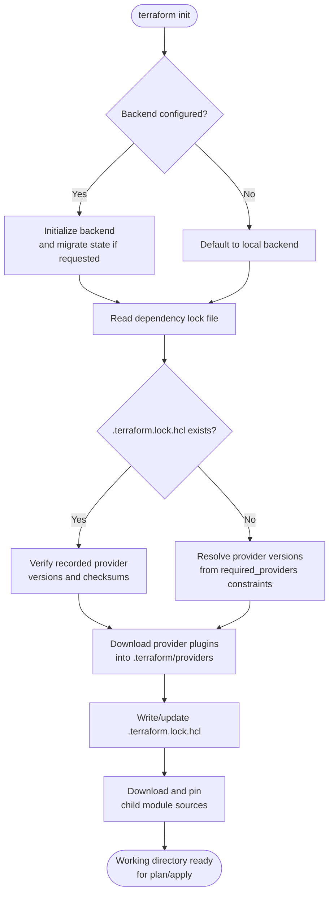

# Diagram 1: Terraform Initialization Workflow

Referenced from [`docs/terraform-internals.md`](../docs/terraform-internals.md) and [Lab 1](../labs/lab-01-core-workflow/).

**Key points:**
- The lock file, once committed, makes provider resolution deterministic across every machine and CI run — `init` without `-upgrade` will never silently pick a newer provider version.
- Backend migration (local → remote, or backend config change) happens here and prompts for confirmation — always back up state first.
- Module source resolution (registry, git, local path) happens on every `init`, but is cached under `.terraform/modules` until sources change.
