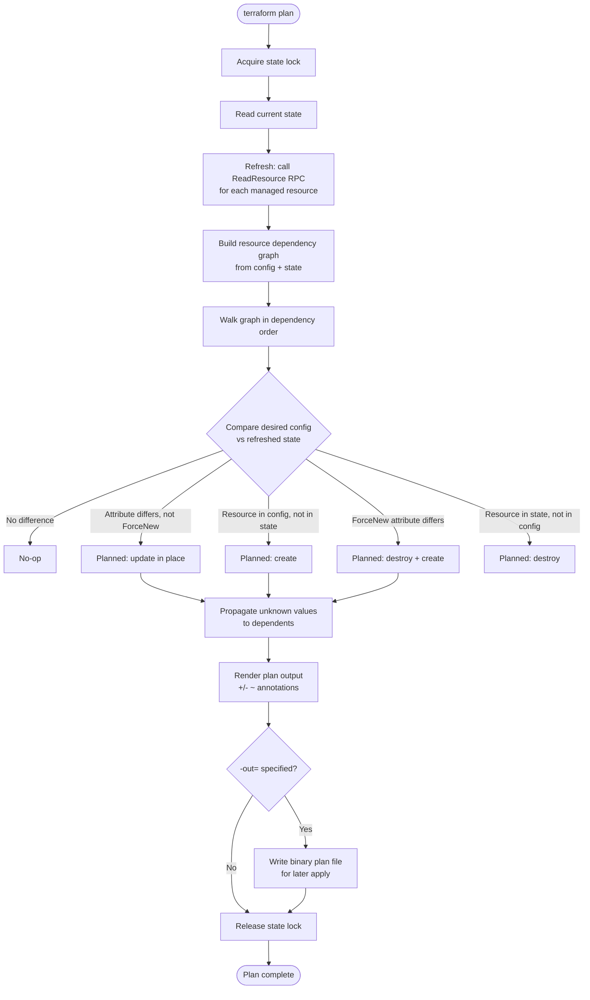

# Diagram 2: Terraform Plan Workflow

Referenced from [`docs/terraform-internals.md`](../docs/terraform-internals.md).

**Key points:**
- Refresh happens as an integrated part of plan by default; `-refresh=false` skips it and trusts existing state.
- A saved plan file (`-out=`) locks in the exact set of changes, including resolved variable values, for later `apply` — critical for the CI/CD pattern of "review a plan, then apply exactly that plan."
- Unknown values (from not-yet-created resources) propagate through the graph and are shown as `(known after apply)`.
