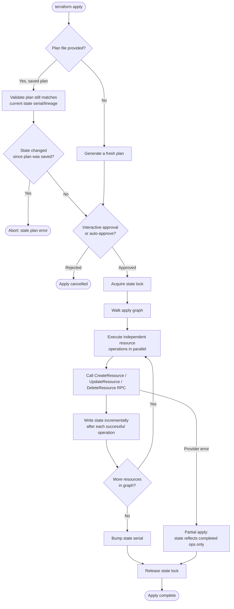

# Diagram 3: Terraform Apply Workflow

Referenced from [`docs/terraform-internals.md`](../docs/terraform-internals.md) and [Lab 1](../labs/lab-01-core-workflow/).

**Key points:**
- Applying a saved plan file re-validates the state's serial/lineage first — this is what prevents applying stale intent against state that moved on.
- State is written incrementally, resource by resource — an interrupted or partially-failed apply never loses track of what actually succeeded.
- Independent branches of the graph run in parallel (`-parallelism`, default 10); a missing `depends_on` for a runtime-only dependency shows up here as intermittent failures.
