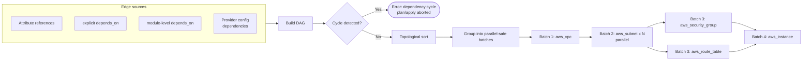

# Diagram 4: Dependency Graph Processing

Referenced from [`docs/terraform-internals.md`](../docs/terraform-internals.md#2-dependency-graph-construction).

**Key points:**
- Terraform infers most edges automatically from attribute references (`aws_subnet.private.id` used elsewhere creates an edge); `depends_on` is the escape hatch for dependencies the graph can't see (IAM eventual consistency, provisioner ordering).
- A genuine cycle (two resources/modules each depending on the other with no way to break the loop) is a hard plan-time error — the fix is architectural (extract the shared concern into a common layer), not a Terraform flag.
- Resources within the same "batch" (no edges between them) are eligible for parallel execution — see [`docs/terraform-internals.md`](../docs/terraform-internals.md) for why this matters when a hidden runtime dependency exists without a corresponding graph edge.
