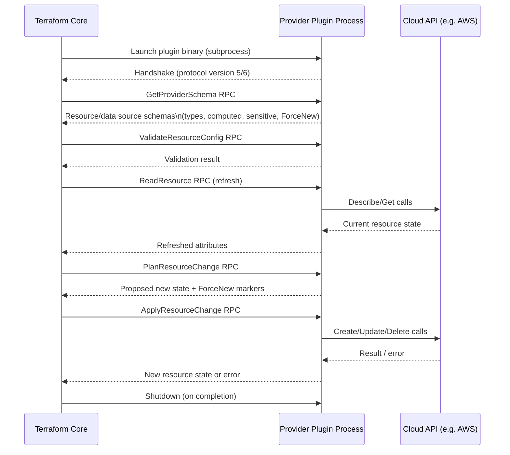

# Diagram 5: Provider Communication (RPC)

Referenced from [`docs/terraform-internals.md`](../docs/terraform-internals.md#9-provider-rpc-communication).

**Key points:**
- Terraform Core has no built-in knowledge of AWS, Kubernetes, or any specific API — everything resource-type-specific comes from the provider's schema, fetched once via RPC.
- A provider crash (segfault/panic) is a plugin process failure, diagnosed with `TF_LOG=trace`, not a Core bug — fixed with a provider version bump or upstream bug report.
- `PlanResourceChange` is where `ForceNew` (ties to §8 of `terraform-internals.md`, resource replacement) is determined per-attribute, per-provider-schema.
