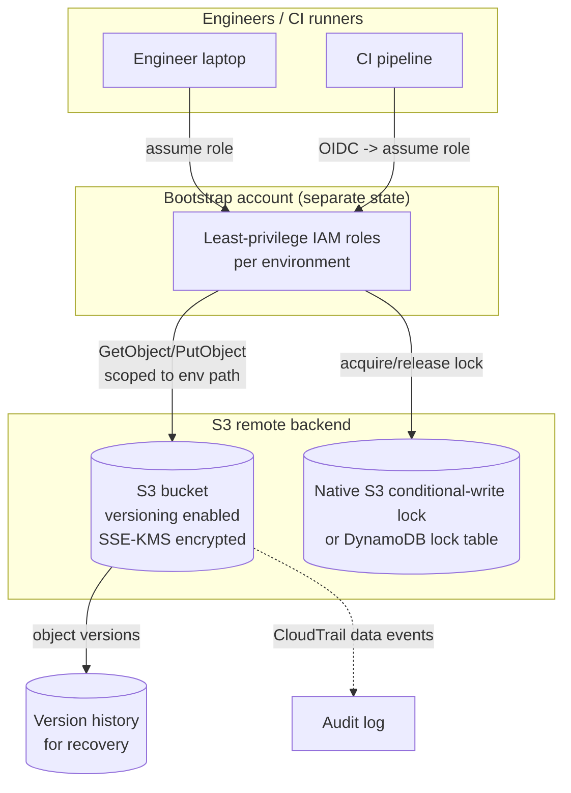

# Diagram 6: Remote-State Architecture

Referenced from [`docs/state-management.md`](../docs/state-management.md) and [Lab 2](../labs/lab-02-remote-state/).

**Key points:**
- The bootstrap layer that creates the state bucket/lock mechanism cannot itself use that backend — it needs its own separate (often local, carefully-controlled) state, per [Lab 2](../labs/lab-02-remote-state/).
- Access is scoped per environment path within the bucket, not bucket-wide, so a compromised dev credential can't read production state.
- Versioning provides the recovery path for corruption; CloudTrail data events provide the audit trail for "who read/wrote state and when."
