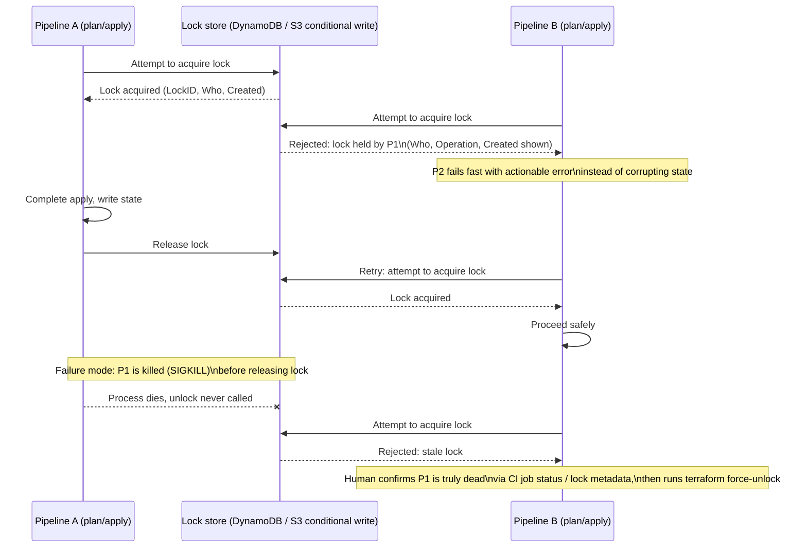

# Diagram 7: State-Locking Workflow

Referenced from [`docs/state-management.md`](../docs/state-management.md#3-state-locking) and [Lab 3](../labs/lab-03-state-locking/).

**Key points:**
- A rejected lock acquisition is the *safe* outcome — it fails fast rather than allowing a concurrent write that could corrupt state.
- Stale locks (from a killed process) require human confirmation before `force-unlock`; forcing an unlock on a still-running process reintroduces the exact race the lock exists to prevent.
- CI concurrency controls (a single mutex/queue per state) prevent contention from happening in the first place — see [`docs/cicd.md`](../docs/cicd.md).
