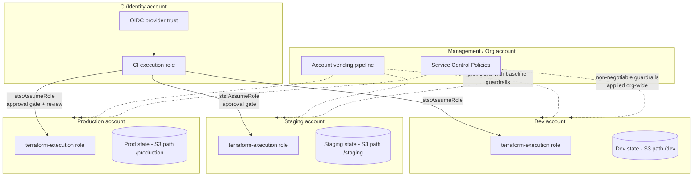

# Diagram 8: Multi-Account AWS Deployment

Referenced from [`docs/terraform-architecture.md`](../docs/terraform-architecture.md#8-multi-account-strategies-landing-zones-and-account-vending) and [Lab 15](../labs/lab-15-enterprise-capstone/).

**Key points:**
- A single CI identity assumes different, narrowly-scoped roles per target account — no account-specific long-lived credentials exist anywhere.
- SCPs enforce guardrails (no public S3, approved regions, mandatory encryption) regardless of what any individual account's IAM policies allow — defense in depth.
- Each account has its own state path/backend scoping, so a plan targeting dev cannot structurally touch production resources.
