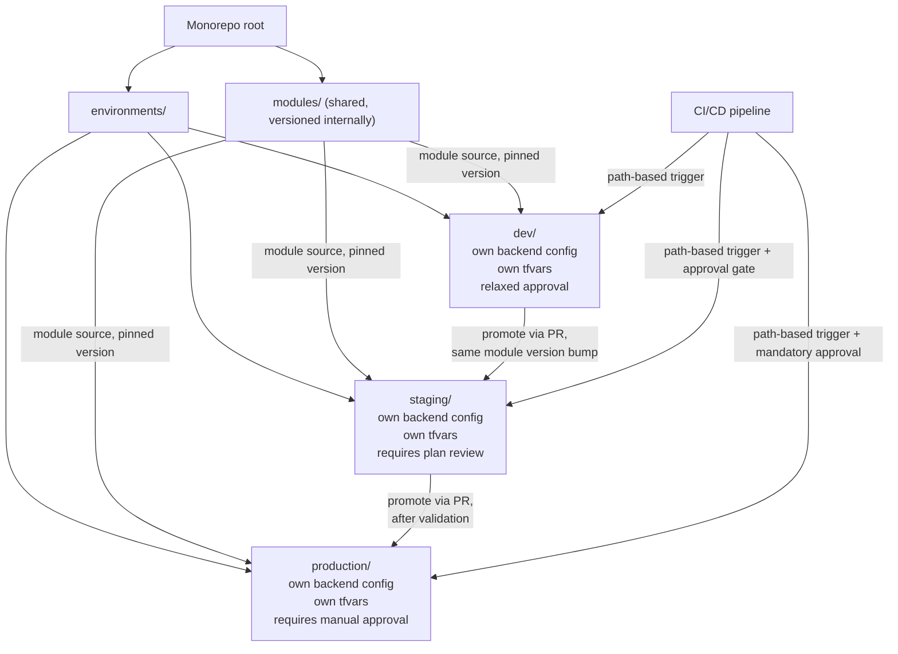

# Diagram 10: Multi-Environment Repository Structure

Referenced from [`docs/terraform-architecture.md`](../docs/terraform-architecture.md#9-repository-architecture-monorepo-vs-repository-per-environment) and [Lab 5](../labs/lab-05-multi-environment/).

**Key points:**
- Each environment directory has its own backend configuration and state — not a shared workspace-selected state — so isolation doesn't depend on remembering to select the right workspace.
- Promotion between environments is a version bump (module source ref, image tag, config value) moved through a reviewed PR, not a copy-paste of raw resources.
- CI approval gates tighten by environment: dev may auto-apply, staging requires a plan review, production requires explicit manual approval (see [`docs/cicd.md`](../docs/cicd.md)).
