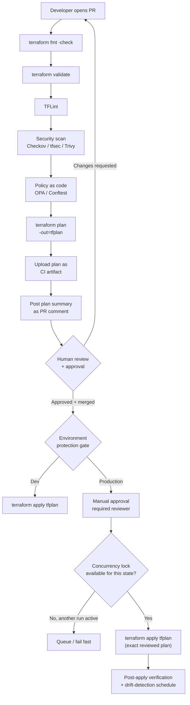

# Diagram 11: CI/CD Workflow

Referenced from [`docs/cicd.md`](../docs/cicd.md) and [Lab 12](../labs/lab-12-cicd-pipeline/).

**Key points:**
- The plan that gets applied is the **exact saved plan artifact** that was reviewed — not a freshly regenerated plan at apply time — closing the gap between "what was approved" and "what was applied."
- Concurrency controls ensure only one pipeline run can hold the lock for a given state at a time, preventing the race this diagram's lock-contention counterpart (Diagram 7) describes.
- Production applies require a distinct, stricter approval gate than dev/staging, enforced by CI environment protection rules, not convention alone.
