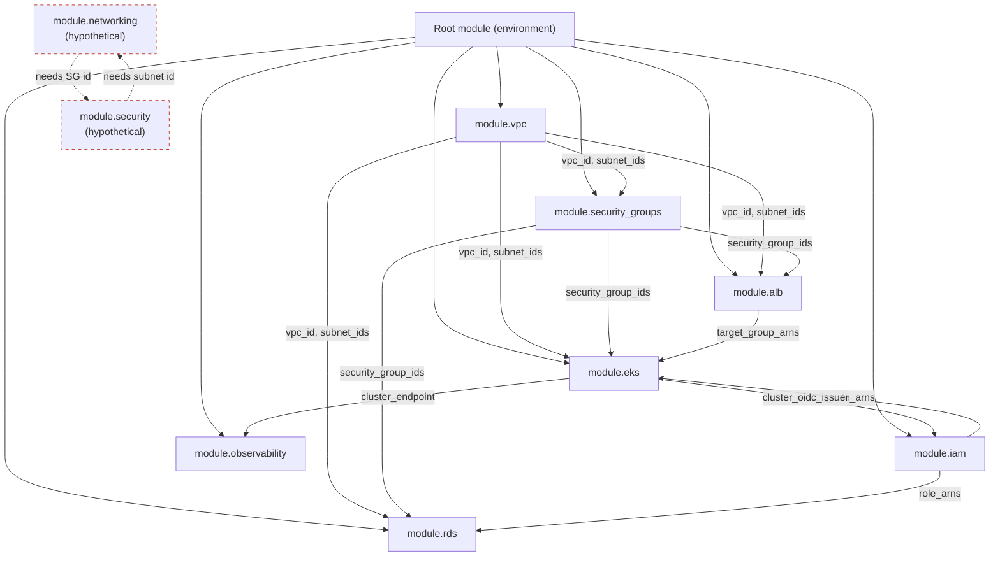

# Diagram 12: Module Dependency Architecture

Referenced from [`docs/module-design.md`](../docs/module-design.md#3-module-composition-and-dependency-design) and [Lab 4](../labs/lab-04-module-design/).

**Key points:**
- Composition flows one direction from foundational (VPC, IAM) to dependent (EKS, RDS, ALB) modules — no module depends on something that depends back on it.
- The dashed red pair at the bottom illustrates the circular-dependency anti-pattern from [`docs/module-design.md`](../docs/module-design.md#3-module-composition-and-dependency-design): the fix is extracting the shared concern (e.g., both take `vpc_id` from a common ancestor) rather than having networking and security modules depend on each other directly.
- `module.eks`'s OIDC issuer feeding back into `module.iam` (for IRSA/pod identity roles) is **not** a cycle — it's a legitimate two-phase dependency resolved within a single root module's graph, since both are child modules of the same root, not two independent modules depending on each other.
