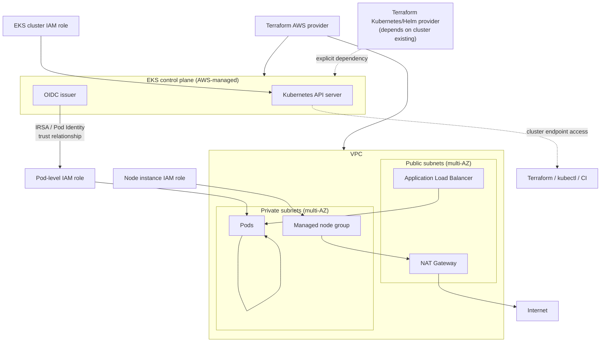

# Diagram 13: EKS Infrastructure Architecture

Referenced from [`docs/`](../docs/) (Phase 3 AWS/EKS documentation) and [Lab 9](../labs/lab-09-eks-infrastructure/).

**Key points:**
- Nodes and pods live in private subnets; only the load balancer sits in public subnets — outbound-only internet access for nodes goes through NAT.
- IRSA (IAM Roles for Service Accounts) or the newer EKS Pod Identity mechanism lets individual pods assume narrowly-scoped IAM roles via the cluster's OIDC issuer, instead of nodes sharing one broad instance role.
- The Kubernetes/Helm Terraform provider configuration depends on the cluster existing first — a common source of "provider configuration depends on a resource" ordering problems, addressed explicitly in [Lab 9](../labs/lab-09-eks-infrastructure/).
