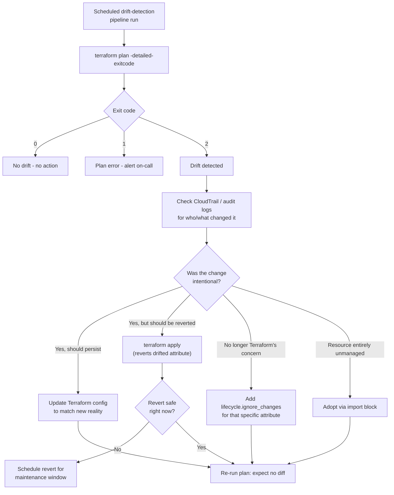

# Diagram 14: Drift Detection and Reconciliation

Referenced from [`docs/state-management.md`](../docs/state-management.md#11-manual-infrastructure-changes-and-drift) and [Lab 14](../labs/lab-14-drift-and-recovery/).

**Key points:**
- `-detailed-exitcode` is what turns `terraform plan` into a machine-readable drift signal for a scheduled pipeline, distinguishing "no changes" from "error" from "changes present."
- Every drift finding routes through a deliberate decision (revert / adopt-into-config / ignore / import) informed by *why* the change happened — never a reflexive re-apply.
- Reverting drift that was actually an emergency manual fix (e.g., a scaled-up RDS instance during an incident) without checking timing/impact first can cause a second outage.
