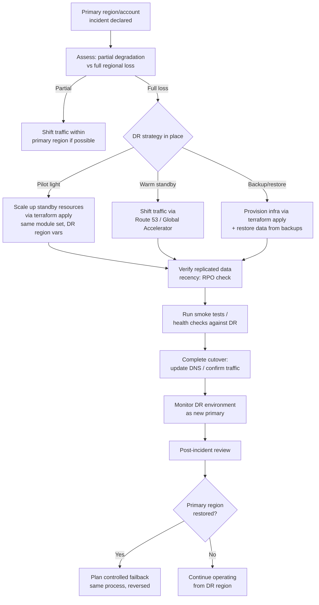

# Diagram 15: Disaster Recovery Workflow

Referenced from [`docs/ha-dr.md`](../docs/ha-dr.md) and [Lab 15](../labs/lab-15-enterprise-capstone/).

**Key points:**
- Which DR strategy (backup/restore, pilot light, warm standby, active/active) is in place determines whether recovery is a `terraform apply` against pre-provisioned-but-scaled-down infrastructure, a traffic shift, or a from-scratch provision-plus-restore — see [`docs/ha-dr.md`](../docs/ha-dr.md) for the RTO/RPO trade-offs of each.
- Because the DR region uses the *same* tested module set (per Diagram 9), the "provision infrastructure" step is a known-good, already-validated operation during an incident, not first-time-ever code.
- Failback is treated as a full, deliberate second exercise of this same workflow in reverse — never an assumption that traffic silently reverts on its own.
