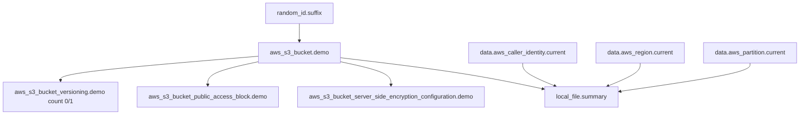

# Lab 1: Terraform Core Workflow

## Objective
Build a small but structurally complete Terraform configuration that exercises every core language and workflow concept — providers, variables, locals, resources, data sources, outputs, the plan/apply lifecycle, and the dependency graph — as a foundation for every later lab.

## Scenario
You're new to a team's Terraform codebase. Before touching anything real, you want a minimal, disposable sandbox to build muscle memory for the core workflow: how Terraform resolves providers, how it builds a plan, what the dependency graph actually looks like, and how state tracks what you've created. This lab is that sandbox — an S3 bucket with a few dependent configuration resources, plus a locally-written summary file, deliberately chosen so total AWS cost is effectively zero.

## Skills Practised
- Provider configuration and `default_tags`
- Input variables with type constraints and `validation` blocks
- Local values for computed naming
- Resources with implicit dependencies (attribute references) and explicit sequencing
- The `count` 0/1 conditional-resource idiom
- Data sources (`aws_caller_identity`, `aws_region`, `aws_partition`)
- A `precondition` inside a resource `lifecycle` block
- Outputs, including one derived from a data source
- `terraform init` / `validate` / `plan` / `apply` / `destroy`
- Reading `terraform graph` output to understand parallel execution batches

## Architecture

`Versioning`, `PublicBlock`, and `Encryption` all depend only on `Bucket` and not on each other — they sit in the same parallel-execution batch during apply.

## Prerequisites
- Terraform >= 1.7 installed (`terraform version`)
- An AWS account with credentials configured (SSO profile or equivalent — see [`docs/terraform-architecture.md`](../../docs/terraform-architecture.md#5-authentication--avoiding-credentials-in-code); never hardcode credentials)
- IAM permissions for: `s3:CreateBucket`, `s3:PutBucketVersioning`, `s3:PutBucketPublicAccessBlock`, `s3:PutEncryptionConfiguration`, `s3:GetBucket*`, `s3:DeleteBucket`, `sts:GetCallerIdentity`
- No prior lab dependency — this is the entry point of the whole repository

## Directory Structure
```text
lab-01-core-workflow/
├── README.md
├── versions.tf
├── variables.tf
├── locals.tf
├── data.tf
├── main.tf
├── outputs.tf
├── terraform.tfvars.example
└── .gitignore
```

## Step-by-Step Tasks
1. Copy `terraform.tfvars.example` to `terraform.tfvars` and adjust `aws_region`/`project_name` if desired.
2. Run `terraform init` and observe the provider download for `aws`, `random`, and `local`.
3. Run `terraform validate` and confirm it passes.
4. Run `terraform plan` and read the output carefully — note which resources show `(known after apply)` for their ID/ARN (they don't exist yet) versus which values are already fully known (from data sources, which have no dependency on anything being created).
5. Run `terraform graph | dot -Tsvg > graph.svg` (requires Graphviz's `dot`; if unavailable, just run `terraform graph` and read the text output) and compare it against the Architecture diagram above.
6. Run `terraform apply` and type `yes` to confirm.
7. Inspect `lab-output/summary.json` after apply completes.
8. Run `terraform plan` again with no changes and confirm it reports "No changes."

## Terraform Configuration
See [`main.tf`](main.tf), [`variables.tf`](variables.tf), [`locals.tf`](locals.tf), [`data.tf`](data.tf), [`outputs.tf`](outputs.tf), and [`versions.tf`](versions.tf) in this directory — all fully runnable as-is once `terraform.tfvars` is in place.

## Commands to Execute
```bash
cp terraform.tfvars.example terraform.tfvars
terraform init
terraform validate
terraform fmt -check
terraform plan -out=lab01.tfplan
terraform graph
terraform apply lab01.tfplan
cat lab-output/summary.json
terraform plan   # should report "No changes"
```

## Expected Output
- `terraform apply` creates 1 `random_id`, 1 `aws_s3_bucket`, 1 `aws_s3_bucket_versioning`, 1 `aws_s3_bucket_public_access_block`, 1 `aws_s3_bucket_server_side_encryption_configuration`, and 1 `local_file` — 6 resources total.
- `lab-output/summary.json` contains your AWS account ID, region, partition, and the created bucket's name/ARN.
- A second `terraform plan` reports zero changes, proving the configuration is idempotent.

## Validation
```bash
# Confirm the bucket exists and matches Terraform's record
aws s3api head-bucket --bucket "$(terraform output -raw bucket_name)"

# Confirm versioning is actually enabled as configured
aws s3api get-bucket-versioning --bucket "$(terraform output -raw bucket_name)"

# Confirm public access block is in place
aws s3api get-public-access-block --bucket "$(terraform output -raw bucket_name)"

# Confirm state accurately lists every resource
terraform state list
```
All four AWS CLI checks should succeed and reflect exactly what the configuration declares — this is the "does state match cloud reality" check that recurs throughout this repository.

## Failure Injection
Deliberately break the precondition to see a plan-time guard fire:
```bash
# Temporarily set project_name to something that produces a >63-character bucket name
terraform plan -var="project_name=this-is-a-deliberately-extremely-long-project-name-for-testing"
```
Expected: the plan fails at the `precondition` inside `aws_s3_bucket.demo`'s `lifecycle` block, with the custom error message, **before** any API call is attempted — proving the precondition catches this class of mistake at plan time, not as an opaque AWS API rejection.

## Troubleshooting Exercise
1. Manually change the bucket's tag `Environment` value via the AWS Console (not Terraform).
2. Run `terraform plan` and observe it detects the drift and proposes to revert the tag.
3. This is your first hands-on encounter with drift detection — read [`docs/state-management.md` §11](../../docs/state-management.md#11-manual-infrastructure-changes-and-drift) for the full decision framework (revert / adopt / ignore / import) before deciding what to do, then either let Terraform revert it or update your configuration to match, deliberately.

## Cleanup
```bash
terraform destroy
```
**Chargeable resources:** none in any meaningful sense — an empty S3 bucket with no objects stored incurs no cost. Object storage would begin incurring (small) charges only if you upload data to it, which this lab never does. Always run `terraform destroy` when finished regardless, as good practice.

## Interview Questions Connected to This Lab
- [Question 1: The subnet that shifted](../../interview-questions/01-terraform-core.md#question-1-the-subnet-that-shifted) — `count` vs `for_each` identity
- [Question 4: The launch template nobody could safely swap](../../interview-questions/01-terraform-core.md#question-4-the-launch-template-nobody-could-safely-swap) — lifecycle meta-arguments
- [Question 88: The merge that duplicated a resource](../../interview-questions/10-troubleshooting.md#question-88-the-merge-that-duplicated-a-resource) — `terraform validate` as a fast, mandatory check

## Production Considerations
- Real production configurations rarely use `default = "sandbox"` for an `environment` variable with no override enforced — see [Lab 5](../lab-05-multi-environment/) for how production environments are actually isolated.
- This lab intentionally omits a remote backend (local state) to keep it dependency-free — see [Lab 2](../lab-02-remote-state/) for why local state is unacceptable for any team or CI context.
- `default_tags` here is a simplified version of the real, organization-wide tagging governance covered in [`interview-questions/13-governance.md`](../../interview-questions/13-governance.md).

## Advanced Challenge
Convert the single `aws_s3_bucket.demo` into a `for_each`-based set of three buckets (e.g., `"logs"`, `"artifacts"`, `"backups"`), each with its own versioning/encryption/public-access-block configuration, using a single `for_each`-driven module-free resource block. Confirm via `terraform plan` that adding a fourth key to the set only creates one new bucket, without touching the other three — contrast this with what would happen if you'd used `count` instead (see [Question 1](../../interview-questions/01-terraform-core.md#question-1-the-subnet-that-shifted)).
