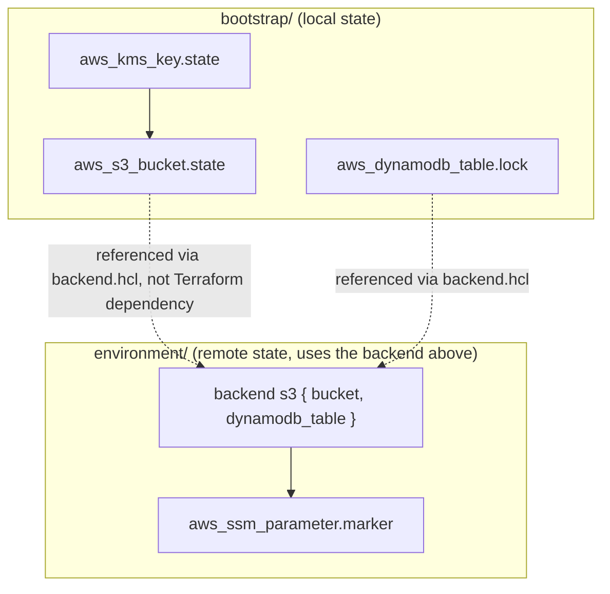

# Lab 2: Secure Remote State

## Objective
Build a production-grade S3 remote state backend from scratch — encrypted, versioned, access-controlled, and locked — and prove the bootstrap chicken-and-egg problem (the configuration that creates the backend cannot use that backend) is solved correctly.

## Scenario
Your team has been using local state (from [Lab 1](../lab-01-core-workflow/)) and is about to onboard a second engineer. Local state cannot be safely shared, has no locking, and risks being accidentally committed to git. You need a real, secure, shared backend before anyone else touches this codebase — and you need to build it in a way that doesn't create a circular dependency on itself.

## Skills Practised
- S3 backend configuration (`backend "s3" {}`)
- State encryption (SSE-KMS with a dedicated key)
- State versioning for recovery
- State locking via DynamoDB
- Bucket policies enforcing TLS and encryption
- The bootstrap problem: a configuration that manages the backend cannot use that backend
- `terraform init -backend-config=`
- Manual state recovery from S3 object versions

## Architecture

The dotted lines are deliberate: `bootstrap/` and `environment/` have **no Terraform-level dependency** on each other — `environment/`'s backend configuration is supplied via a separately-generated `backend.hcl` file, not a Terraform resource reference, which is precisely how the bootstrap problem is solved.

## Prerequisites
- [Lab 1](../lab-01-core-workflow/) completed (familiarity with core workflow)
- AWS credentials with permissions for: S3 bucket/policy/encryption/versioning management, KMS key creation, DynamoDB table creation, SSM parameter write
- Terraform >= 1.7

## Directory Structure
```text
lab-02-remote-state/
├── README.md
├── .gitignore
├── bootstrap/
│   ├── versions.tf        # local state only, intentionally
│   ├── variables.tf
│   ├── main.tf             # KMS key, S3 bucket, DynamoDB lock table
│   ├── outputs.tf
│   └── terraform.tfvars.example
├── environment/
│   ├── versions.tf         # backend "s3" {} - partial config
│   ├── backend.hcl.example
│   ├── variables.tf
│   ├── main.tf
│   └── outputs.tf
└── scripts/
    └── state-recovery.sh
```

## Step-by-Step Tasks
1. In `bootstrap/`, copy `terraform.tfvars.example` to `terraform.tfvars`, choosing a **globally unique** `state_bucket_name`.
2. Run `terraform init && terraform apply` inside `bootstrap/` — this uses local state, by design.
3. Capture the outputs: `terraform output -raw state_bucket_name` and `terraform output -raw lock_table_name`.
4. In `environment/`, copy `backend.hcl.example` to `backend.hcl` and fill in those two values.
5. Run `terraform init -backend-config=backend.hcl` inside `environment/` — Terraform now stores this configuration's state in the S3 bucket you just created.
6. Run `terraform apply` inside `environment/`.
7. Confirm the state object now exists in S3: `aws s3 ls s3://<bucket-name>/lab-02/environment/`.
8. Confirm versioning is capturing history: make a trivial change (e.g., change `project_name`), re-apply, then run the `state-recovery.sh` script to see multiple object versions.

## Terraform Configuration
See [`bootstrap/main.tf`](bootstrap/main.tf) for the backend infrastructure itself, and [`environment/main.tf`](environment/main.tf) for a minimal configuration consuming that backend.

## Commands to Execute
```bash
# 1. Bootstrap the backend (local state)
cd bootstrap
cp terraform.tfvars.example terraform.tfvars   # edit state_bucket_name first!
terraform init
terraform apply

BUCKET=$(terraform output -raw state_bucket_name)
TABLE=$(terraform output -raw lock_table_name)
echo "bucket=$BUCKET  table=$TABLE"

# 2. Configure and apply the environment using the new remote backend
cd ../environment
cat > backend.hcl <<EOF
bucket         = "${BUCKET}"
region         = "us-east-1"
dynamodb_table = "${TABLE}"
EOF
terraform init -backend-config=backend.hcl
terraform apply

# 3. Confirm state now lives in S3, not locally
aws s3 ls "s3://${BUCKET}/lab-02/environment/"
ls *.tfstate 2>&1   # should NOT find a local state file here
```

## Expected Output
- `bootstrap/terraform.tfstate` exists **locally** (this is correct and expected).
- No `terraform.tfstate` file exists locally inside `environment/` — its state lives entirely in S3.
- `aws s3api get-bucket-versioning --bucket <bucket>` reports `Status: Enabled`.
- `aws s3api get-bucket-encryption --bucket <bucket>` reports `aws:kms` as the SSE algorithm.

## Validation
```bash
# Confirm encryption
aws s3api get-bucket-encryption --bucket "$BUCKET"

# Confirm versioning
aws s3api get-bucket-versioning --bucket "$BUCKET"

# Confirm public access is fully blocked
aws s3api get-public-access-block --bucket "$BUCKET"

# Confirm the lock table exists and is empty (no stuck locks)
aws dynamodb scan --table-name "$TABLE" --query 'Count'

# Confirm the bucket policy denies non-TLS access (should show the Deny statement)
aws s3api get-bucket-policy --bucket "$BUCKET" | jq -r '.Policy' | jq '.Statement[] | select(.Sid=="DenyInsecureTransport")'
```

## Failure Injection
Simulate a stale lock and observe the safe failure mode:
```bash
cd environment
# Manually insert a fake lock item to simulate a crashed process holding the lock
aws dynamodb put-item --table-name "$TABLE" --item '{
  "LockID": {"S": "'"${BUCKET}"'/lab-02/environment/terraform.tfstate"},
  "Info": {"S": "{\"ID\":\"fake-lock\",\"Who\":\"simulated@crash\",\"Created\":\"2020-01-01T00:00:00Z\"}"}
}'

terraform plan   # should fail immediately with a clear lock-held error

# Recovery: confirm no real process holds it (in this drill, we know it's fake), then:
terraform force-unlock fake-lock
terraform plan   # should now succeed
```
This is a safe, deliberate rehearsal of the exact stale-lock scenario covered in [Question 12](../../interview-questions/02-state-management.md#question-12-the-lock-that-would-not-die) — never run `force-unlock` against a real lock without confirming the original process is actually dead.

## Troubleshooting Exercise
1. Delete `backend.hcl` and run `terraform init` again with no `-backend-config` flag.
2. Observe Terraform prompt for the missing backend configuration values interactively, or fail with a clear error depending on your Terraform version.
3. This demonstrates why `backend.hcl` (gitignored, per-environment) must never be committed, and why CI pipelines must supply these values explicitly (via `-backend-config` flags or a checked-in, non-secret `backend.hcl` if the bucket name itself isn't sensitive).

## Cleanup
```bash
# Destroy the environment FIRST (it depends on the backend existing to run destroy)
cd environment
terraform destroy

# Then destroy the bootstrap resources (this will fail due to prevent_destroy on
# the S3 bucket - remove that lifecycle block deliberately if you truly want to
# tear this down, per the two-step pattern in Question 3)
cd ../bootstrap
# Edit main.tf: remove `prevent_destroy = true` from aws_s3_bucket.state
terraform apply   # applies the lifecycle change only
terraform destroy
```
**Chargeable resources:** the S3 bucket (near-zero, no data stored), the KMS key (a small monthly per-key charge — verify current AWS KMS pricing), and the DynamoDB table (PAY_PER_REQUEST, near-zero at lab-scale usage). None of these are significant, but always run the cleanup above when finished.

## Interview Questions Connected to This Lab
- [Question 18: Bootstrapping the backend that doesn't exist yet](../../interview-questions/02-state-management.md#question-18-bootstrapping-the-backend-that-doesnt-exist-yet)
- [Question 11: Two pipelines, one state](../../interview-questions/02-state-management.md#question-11-two-pipelines-one-state)
- [Question 12: The lock that would not die](../../interview-questions/02-state-management.md#question-12-the-lock-that-would-not-die)
- [Question 17: The password in the state export](../../interview-questions/02-state-management.md#question-17-the-password-in-the-state-export)

## Production Considerations
- This lab uses DynamoDB-based locking for broad compatibility; verify whether your Terraform/backend version supports native S3 conditional-write locking (removing the need for a separate DynamoDB table) before deciding which to use in a new production setup.
- A real production bootstrap should be run through CI/OIDC like everything else, not from a laptop — see [`docs/cicd.md`](../../docs/cicd.md) — this lab runs it manually purely for teaching clarity.
- Consider per-environment state paths under one bucket (`prod/`, `staging/`, `dev/`) with scoped IAM policies restricting which roles can read which path, rather than one bucket-wide policy for every environment.

## Advanced Challenge
Add a bucket policy statement restricting `s3:GetObject`/`s3:PutObject` on this bucket to only a specific IAM role ARN (simulate a CI role), and confirm your own current credentials — if they're a different principal — are now denied access, proving the least-privilege scoping actually works before you rely on it in production.
