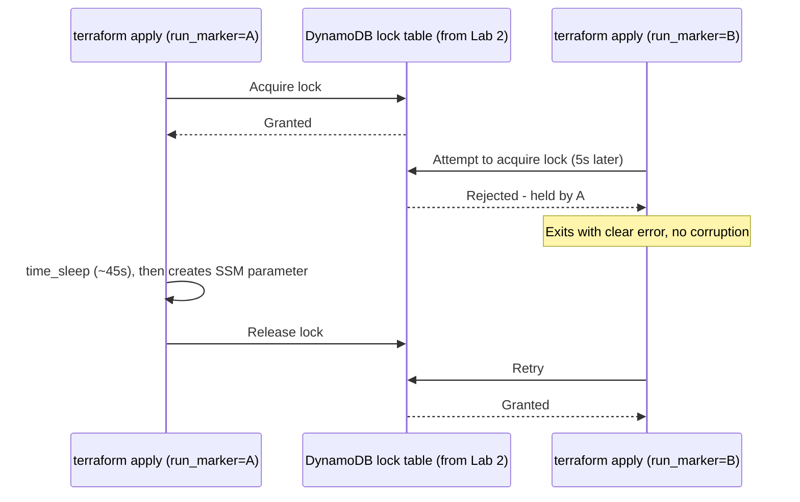

# Lab 3: Concurrent Execution and Locking

## Objective
Directly observe Terraform's state-locking behavior under real contention: lock acquisition, lock rejection, safe recovery from a stale lock, and why forced unlocks are dangerous when misused.

## Scenario
Two engineers (or an engineer and a CI pipeline) occasionally hit "Error acquiring the state lock" and don't understand what's actually happening under the hood, or whether it's safe to just run `force-unlock`. This lab reproduces both a normal lock-contention event and a genuinely stale lock, so you experience the difference firsthand rather than only reading about it.

## Skills Practised
- Real state lock acquisition/contention against a DynamoDB-backed S3 lock
- Reading and interpreting a lock-error message (`Who`, `Created`, `Operation`)
- Safe vs. unsafe use of `terraform force-unlock`
- CI concurrency-control design (conceptual, tied to [`docs/cicd.md`](../../docs/cicd.md))
- A legitimate, narrow use of `time_sleep` (simulating a long-running apply for lab purposes)

## Architecture


## Prerequisites
- [Lab 2](../lab-02-remote-state/) completed — this lab reuses its S3 bucket and DynamoDB lock table
- The `bucket`/`dynamodb_table` values from Lab 2's bootstrap outputs

## Directory Structure
```text
lab-03-state-locking/
├── README.md
├── versions.tf        # backend "s3" {}, distinct key from Lab 2's environment/
├── variables.tf
├── main.tf             # time_sleep + aws_ssm_parameter
├── outputs.tf
└── scripts/
    ├── simulate-concurrent-apply.sh
    └── induce-stale-lock.sh
```

## Step-by-Step Tasks
1. Reuse Lab 2's backend: `terraform init -backend-config=../lab-02-remote-state/environment/backend.hcl` (or create your own `backend.hcl` pointing at the same bucket/table).
2. Run `terraform apply` once normally first, to confirm the configuration works end to end.
3. Run `./scripts/simulate-concurrent-apply.sh` and observe the second apply fail with a lock error while the first is still running.
4. Run `./scripts/induce-stale-lock.sh <lock-table-name> <bucket-name>` to simulate and recover from a genuinely stale lock.
5. Read [`docs/state-management.md` §3](../../docs/state-management.md#3-state-locking) alongside your observed output to connect what you just saw to the underlying mechanism.

## Terraform Configuration
See [`main.tf`](main.tf) — a `time_sleep` resource creates a deliberate delay window, followed by a trivial `aws_ssm_parameter` resource.

## Commands to Execute
```bash
terraform init -backend-config=../lab-02-remote-state/environment/backend.hcl
terraform apply -auto-approve -var="run_marker=0"   # baseline run

chmod +x scripts/*.sh
./scripts/simulate-concurrent-apply.sh

# Get bucket/table names from Lab 2's bootstrap
BUCKET=$(terraform -chdir=../lab-02-remote-state/bootstrap output -raw state_bucket_name)
TABLE=$(terraform -chdir=../lab-02-remote-state/bootstrap output -raw lock_table_name)
./scripts/induce-stale-lock.sh "$TABLE" "$BUCKET"
```

## Expected Output
- The second concurrent apply exits non-zero with `Error acquiring the state lock`, showing `Who`, `Created`, and `Operation` fields identifying the first run.
- After the first apply completes and releases the lock, a retried second apply succeeds.
- The stale-lock drill shows the same lock error, then a successful `terraform force-unlock <fake-id>` followed by a clean `terraform plan`.

## Validation
```bash
# Confirm the lock table is empty after all drills complete (no leaked locks)
aws dynamodb scan --table-name "$TABLE" --query 'Count'
# Should be 0

# Confirm state reflects exactly one aws_ssm_parameter, regardless of how many
# concurrent/retried applies you ran
terraform state list
```

## Failure Injection
Already built into this lab's core exercise — see Step-by-Step Tasks 3 and 4 above. As an additional injection: kill a real apply mid-run with `Ctrl+C` twice in quick succession (a hard interrupt) during the `time_sleep` delay, and observe that the lock is left held (a REAL stale lock, not simulated) — then practice the same recovery process, this time confirming via `ps`/job status that no process is actually still running before you `force-unlock`.

## Troubleshooting Exercise
After the hard-interrupt injection above, run `terraform plan` before force-unlocking and read the exact error message. Identify the `LockID` value from the error, and manually inspect that item in DynamoDB (`aws dynamodb get-item --table-name "$TABLE" --key '{"LockID":{"S":"<value>"}}'`) to see the raw lock metadata Terraform itself reads.

## Cleanup
```bash
terraform destroy -auto-approve
# Confirm no orphaned lock items remain (see Validation above)
```
**Chargeable resources:** none beyond what Lab 2 already provisions (this lab creates only one SSM parameter, which is free at Standard tier).

## Interview Questions Connected to This Lab
- [Question 11: Two pipelines, one state](../../interview-questions/02-state-management.md#question-11-two-pipelines-one-state)
- [Question 12: The lock that would not die](../../interview-questions/02-state-management.md#question-12-the-lock-that-would-not-die)
- [Question 72: The queue nobody could see](../../interview-questions/08-cicd.md#question-72-the-queue-nobody-could-see)

## Production Considerations
- This lab's `time_sleep`-induced delay is purely a teaching device to create a real contention window — never use `time_sleep` this way in production configurations (see [Question 98](../../interview-questions/10-troubleshooting.md#question-98-the-resource-terraform-swore-didnt-exist-yet) for `time_sleep`'s one legitimate production use case).
- Real CI/CD pipelines should add a concurrency group (per [`docs/cicd.md` §6](../../docs/cicd.md#6-concurrency-controls)) so contention like this is resolved by queuing before it ever reaches the backend lock, rather than surfacing as a failed pipeline run.

## Advanced Challenge
Modify `simulate-concurrent-apply.sh` to launch three concurrent applies instead of two, and observe/document the order in which they acquire the lock. Then design (in pseudocode or an actual GitHub Actions snippet) a concurrency-group configuration that would have prevented all but one from even attempting to acquire the lock simultaneously.
