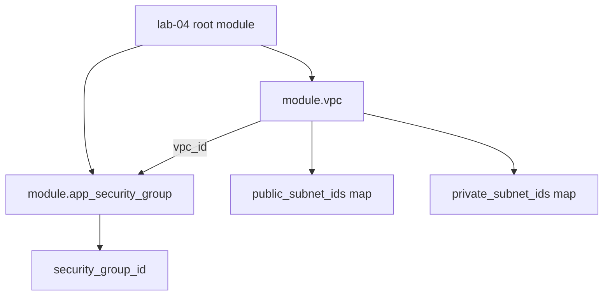

# Lab 4: Production Module Design

## Objective
Build and consume genuinely reusable, opinionated Terraform modules — VPC/subnets/route tables and security groups — with input validation, preconditions, well-designed outputs, documentation, and a native test suite, then compose them into a working root configuration.

## Scenario
Your organization is tired of every team hand-rolling its own VPC and security-group Terraform code with inconsistent quality. You've been asked to build the first two shared, production-grade modules everyone else will build on top of — [`modules/vpc`](../../modules/vpc/) and [`modules/security-groups`](../../modules/security-groups/) — and prove they're safe to reuse via tests, not just by reading the code.

## Skills Practised
- Module interface design: required vs. optional inputs, `optional()` object attributes
- `validation` blocks catching bad input before it reaches any provider call
- `precondition` blocks on module outputs asserting real invariants
- Composition: a root module wiring two independent child modules together
- Avoiding the deeply-nested-module and overly-generic-module anti-patterns
- `terraform-docs`-style module documentation
- Native `terraform test` with `mock_provider` for zero-cost, zero-credential unit testing

## Architecture


## Prerequisites
- [Lab 2](../lab-02-remote-state/) completed (this lab uses the same remote backend)
- AWS credentials with VPC/EC2 networking and security group permissions
- Terraform >= 1.7, with `mock_provider` support for the module test suites (verify against your installed version — see [`docs/testing.md` §4](../../docs/testing.md#4-mock-providers))

## Directory Structure
```text
modules/
├── vpc/
│   ├── README.md
│   ├── versions.tf, variables.tf, locals.tf, main.tf, outputs.tf
│   └── tests/vpc_basic.tftest.hcl
└── security-groups/
    ├── README.md
    ├── versions.tf, variables.tf, main.tf, outputs.tf
    └── tests/security_groups_basic.tftest.hcl

labs/lab-04-module-design/
├── README.md (this file)
├── versions.tf, variables.tf, main.tf, outputs.tf
```

## Step-by-Step Tasks
1. Read [`modules/vpc/README.md`](../../modules/vpc/README.md) and [`modules/security-groups/README.md`](../../modules/security-groups/README.md) in full before writing anything.
2. Run the module test suites **first**, before ever applying real infrastructure — they cost nothing and catch input-validation regressions immediately.
3. Review `main.tf` in this directory: note that `module.app_security_group` receives `module.vpc.vpc_id` directly — a normal, one-directional module composition, not a circular dependency.
4. Run `terraform init`, `plan`, and `apply` for this lab's root configuration.
5. Deliberately break the `security-groups` module's public-CIDR guard (Failure Injection below) and observe the validation block reject it.

## Terraform Configuration
See [`modules/vpc/main.tf`](../../modules/vpc/main.tf), [`modules/security-groups/main.tf`](../../modules/security-groups/main.tf), and this lab's own [`main.tf`](main.tf).

## Commands to Execute
```bash
# 1. Run module tests FIRST - zero cost, zero credentials needed (mock_provider)
cd ../../modules/vpc && terraform init && terraform test
cd ../security-groups && terraform init && terraform test

# 2. Apply the actual lab infrastructure
cd ../../labs/lab-04-module-design
terraform init -backend-config=../lab-02-remote-state/environment/backend.hcl
terraform plan
terraform apply
```

## Expected Output
- Both module test suites report all `run` blocks passing.
- The lab's `apply` creates: 1 VPC, 2 public subnets, 2 private subnets, 1 public route table + associations, 2 private route tables + associations (no NAT since `nat_strategy = "none"`), 1 S3 Gateway endpoint, 1 security group with 1 ingress rule.
- Outputs show `public_subnet_ids`/`private_subnet_ids` as maps keyed by AZ name, not a list.

## Validation
```bash
terraform state list
aws ec2 describe-vpcs --vpc-ids "$(terraform output -raw vpc_id)"
aws ec2 describe-security-groups --group-ids "$(terraform output -raw app_security_group_id)"

# Confirm the S3 endpoint is attached to every route table
aws ec2 describe-vpc-endpoints --filters "Name=vpc-id,Values=$(terraform output -raw vpc_id)"
```

## Failure Injection
Attempt to add a public, unguarded ingress rule directly to this lab's `main.tf`:
```hcl
# Temporarily add this to module "app_security_group"'s ingress_rules:
ssh_open_to_world = {
  from_port   = 22
  to_port     = 22
  protocol    = "tcp"
  cidr_blocks = ["0.0.0.0/0"]
  # allow_public intentionally omitted
}
```
Run `terraform plan` and confirm it fails at the module's `validation` block with a clear error, **before** any AWS API call is attempted — this is [Question 2](../../interview-questions/01-terraform-core.md#question-2-the-security-group-nobody-could-safely-resize) made concrete.

## Troubleshooting Exercise
Change `availability_zones` to a 3-element list, `terraform plan`, and confirm the VPC module creates exactly one new public and one new private subnet — not a full replacement of the existing two. This proves the `for_each`-by-AZ-name design (not `count`) is working as intended; contrast with what a `count`-based module would have done here (see [Question 1](../../interview-questions/01-terraform-core.md#question-1-the-subnet-that-shifted)).

## Cleanup
```bash
terraform destroy
```
**Chargeable resources:** none of real significance — `nat_strategy = "none"` avoids any NAT gateway charges entirely for this lab. The VPC, subnets, route tables, security group, and S3 endpoint are all free.

## Interview Questions Connected to This Lab
- [Question 2: The security group nobody could safely resize](../../interview-questions/01-terraform-core.md#question-2-the-security-group-nobody-could-safely-resize)
- [Question 24: The module that depended on itself](../../interview-questions/03-modules.md#question-24-the-module-that-depended-on-itself)
- [Question 25: The module with fifty optional variables](../../interview-questions/03-modules.md#question-25-the-module-with-fifty-optional-variables)
- [Question 27: The VPC module that only gave you an ID](../../interview-questions/03-modules.md#question-27-the-vpc-module-that-only-gave-you-an-id)
- [Question 33: The module that let you forget encryption](../../interview-questions/03-modules.md#question-33-the-module-that-let-you-forget-encryption)

## Production Considerations
- `nat_strategy = "none"` is a lab-only cost optimization — a real production VPC needs at least `"single"` (or `"per_az"` for full HA) if any private-subnet workload needs outbound internet access.
- This module is consumed via a relative path here for teaching simplicity; see [Lab 5](../lab-05-multi-environment/) for how the same module is consumed via a versioned source across dev/staging/production.

## Advanced Challenge
Add a third module, `modules/alb` (a minimal ALB + target group), and wire it to reference `module.vpc.public_subnet_ids` and `module.app_security_group.security_group_id`. Confirm the composition remains one-directional (no cycles) and that the ALB module itself declares no hardcoded provider block, per the reusability lesson from [Question 35](../../interview-questions/04-providers.md#question-35-the-module-that-could-only-ever-talk-to-one-account).
