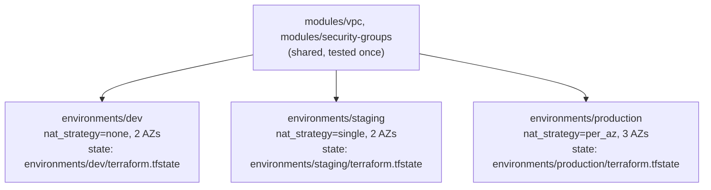

# Lab 5: Multi-Environment Architecture

## Objective
Deploy the same shared modules (`vpc`, `security-groups`) into three genuinely isolated environments — dev, staging, production — each with its own state, its own backend path, and its own configuration, proving isolation doesn't depend on CLI workspaces.

## Scenario
Your organization has one set of shared modules and needs dev, staging, and production environments that: share the same tested module code, differ in configuration (NAT strategy, AZ count, CIDR), and are structurally incapable of a dev-targeted apply accidentally touching production. This lab is the concrete implementation of [`docs/terraform-architecture.md` §10](../../docs/terraform-architecture.md#10-why-cli-workspaces-are-not-sufficient-for-production-isolation).

## Skills Practised
- Repository-per-environment-directory architecture (not CLI workspaces)
- Separate backend state paths per environment
- Shared module consumption with environment-specific configuration
- Environment promotion via a reviewed config/version change, not a resource copy-paste
- Deliberately different NAT/HA trade-offs per environment tier

## Architecture

Each environment is a **separate root module** with its own `backend` block pointing at a distinct state key — never a shared state selected via `terraform workspace select`.

## Prerequisites
- [Lab 2](../lab-02-remote-state/) and [Lab 4](../lab-04-module-design/) completed
- AWS credentials with VPC/networking permissions

## Directory Structure
```text
environments/
├── dev/
│   ├── versions.tf   # backend key: environments/dev/terraform.tfstate
│   ├── variables.tf, main.tf, outputs.tf
│   └── terraform.tfvars.example
├── staging/
│   ├── versions.tf   # backend key: environments/staging/terraform.tfstate
│   ├── variables.tf, main.tf, outputs.tf
│   └── terraform.tfvars.example
└── production/
    ├── versions.tf   # backend key: environments/production/terraform.tfstate
    ├── variables.tf, main.tf, outputs.tf
    └── terraform.tfvars.example
```

## Step-by-Step Tasks
1. Copy each environment's `terraform.tfvars.example` to `terraform.tfvars`.
2. Initialize and apply **dev first**: `cd environments/dev && terraform init -backend-config=... && terraform apply`.
3. Repeat for staging, then production — note each `terraform init` targets a **different backend key**, not a workspace switch.
4. Run `terraform workspace list` in any one environment directory and observe it only ever shows `default` — this repository intentionally never uses named workspaces for environment separation.
5. Confirm isolation directly: from `environments/dev/`, run `terraform state list` and confirm it shows only dev's resources — there is no command you can run from the dev directory that would show or affect production's resources, because production's state isn't even reachable from here without explicitly re-initializing against a different backend key.

## Terraform Configuration
See [`environments/dev/main.tf`](../../environments/dev/main.tf), [`environments/staging/main.tf`](../../environments/staging/main.tf), and [`environments/production/main.tf`](../../environments/production/main.tf) — same two modules, different `nat_strategy` and `availability_zones` per environment.

## Commands to Execute
```bash
BACKEND_CONFIG=../lab-02-remote-state/environment/backend.hcl

cd environments/dev
cp terraform.tfvars.example terraform.tfvars
terraform init -backend-config="$BACKEND_CONFIG"
terraform apply

cd ../staging
cp terraform.tfvars.example terraform.tfvars
terraform init -backend-config="$BACKEND_CONFIG"
terraform apply

cd ../production
cp terraform.tfvars.example terraform.tfvars
terraform init -backend-config="$BACKEND_CONFIG"
terraform apply
```

## Expected Output
- Three independent VPCs exist, each with a distinct CIDR (`10.10.0.0/16`, `10.20.0.0/16`, `10.30.0.0/16`).
- `dev` has zero NAT gateways, `staging` has one, `production` has three (one per AZ).
- Each environment's state object lives at its own distinct S3 key under the shared bucket from Lab 2.

## Validation
```bash
# Confirm the three state objects are genuinely separate
aws s3 ls "s3://$BUCKET/environments/" --recursive

# Confirm NAT gateway count matches the expected per-environment strategy
for env in dev staging production; do
  echo "=== $env ==="
  aws ec2 describe-nat-gateways --filter "Name=tag:Environment,Values=$env" \
    --query 'length(NatGateways[?State==`available`])'
done
# Expect: dev=0, staging=1, production=3
```

## Failure Injection
From `environments/dev/`, attempt to reference a production output via `terraform_remote_state` pointed at production's state key, then deliberately misconfigure the key to point at a **nonexistent** path. Observe the failure — this demonstrates why the parameter-store pattern (see [Question 16](../../interview-questions/02-state-management.md#question-16-the-outage-that-started-in-someone-elses-state)) is preferred over direct cross-environment state references for anything beyond tightly-coupled, same-team configurations.

## Troubleshooting Exercise
Simulate the "wrong environment" mistake from [Question 89](../../interview-questions/10-troubleshooting.md#question-89-the-apply-that-hit-the-wrong-account): from `environments/staging/`, run `terraform plan` while your AWS credentials are actually configured for a *different* account than staging's intended account (if you have access to a second account/profile, switch to it temporarily). Observe that the plan either fails outright (no such resources exist there) or, worse, proposes creating everything fresh — reinforcing why per-environment credentials/roles, not just per-environment state keys, matter for true isolation.

## Cleanup
```bash
# Destroy in reverse dependency order - production last is NOT required here since
# there's no cross-environment dependency, but destroy deliberately, one at a time
cd environments/production && terraform destroy
cd ../staging && terraform destroy
cd ../dev && terraform destroy
```
**Chargeable resources:** staging's single NAT gateway and production's three NAT gateways incur real, ongoing hourly + data-processing charges — verify current AWS NAT Gateway pricing and do not leave these running unattended. Dev incurs no NAT cost at all.

## Interview Questions Connected to This Lab
- [Question 43: A hundred accounts, several regions, one Terraform estate](../../interview-questions/05-aws-architecture.md#question-43-a-hundred-accounts-several-regions-one-terraform-estate)
- [Question 89: The apply that hit the wrong account](../../interview-questions/10-troubleshooting.md#question-89-the-apply-that-hit-the-wrong-account)
- [`docs/terraform-architecture.md` §10](../../docs/terraform-architecture.md#10-why-cli-workspaces-are-not-sufficient-for-production-isolation)

## Production Considerations
- A real organization would use separate AWS **accounts** per environment (not just separate state keys in one account), per the multi-account architecture in [`docs/terraform-architecture.md`](../../docs/terraform-architecture.md#8-multi-account-strategies-landing-zones-and-account-vending) — this lab uses one account with separate state paths purely for teaching accessibility.
- Promotion between environments in a real pipeline is a version-bump PR (bumping a pinned module version, or a config value) reviewed and merged, not a manual copy-paste between environment directories.

## Advanced Challenge
Restructure this lab's three environment directories to each consume the `vpc` module via a **pinned registry version** (`version = "~> 1.0"`) instead of a relative path, simulating what a real multi-repo or registry-based setup would look like, and write a short promotion runbook describing exactly what changes (and what doesn't) when promoting a module version from dev through staging to production.
