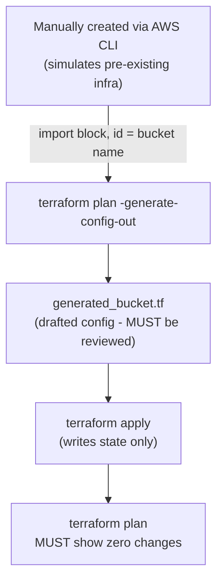

# Lab 6: Import Existing Infrastructure

## Objective
Create a resource entirely outside Terraform (simulating infrastructure that predates your Terraform adoption), then bring it under Terraform management safely using `import` blocks and `-generate-config-out`, verifying the adoption with a zero-diff plan.

## Scenario
A bucket was created months ago via the AWS Console or CLI by someone who's since left the team. It's still in active use. You need to bring it under Terraform management without recreating it (which would mean data loss and a service interruption) and without guessing at its configuration by hand.

## Skills Practised
- Creating infrastructure manually to simulate a pre-Terraform resource
- `import` blocks (declarative, reviewable, Terraform >= 1.5)
- `terraform plan -generate-config-out=` to draft matching configuration automatically
- Reviewing generated configuration against real-world resource attributes
- The mandatory zero-diff-plan verification after any import
- Safe adoption discipline (never guess-and-hope)

## Architecture


## Prerequisites
- [Lab 2](../lab-02-remote-state/) completed
- AWS credentials with S3 bucket create/read/import permissions
- Terraform >= 1.5 (for `import` blocks and `-generate-config-out`)

## Directory Structure
```text
lab-06-import-existing-infrastructure/
├── README.md
├── .gitignore              # ignores generated_bucket.tf (learner-specific)
├── versions.tf
├── variables.tf
├── import.tf                # the import block itself
└── outputs.tf
```

## Step-by-Step Tasks
1. **Simulate pre-existing infrastructure** — create a bucket manually, entirely outside Terraform:
   ```bash
   aws s3api create-bucket --bucket "my-name-lab06-adopted-$(date +%s)" --region us-east-1
   ```
   Note the exact bucket name printed/used — this is your "resource nobody documented."
2. Set `manually_created_bucket_name` in a `terraform.tfvars` to that exact name.
3. Run `terraform init -backend-config=../lab-02-remote-state/environment/backend.hcl`.
4. Run `terraform plan -generate-config-out=generated_bucket.tf` — review the plan output; it should show the import, plus a generated resource block being drafted.
5. **Open `generated_bucket.tf` and read it carefully** — compare every attribute against `aws s3api get-bucket-... ` calls for the real bucket (versioning, encryption, tags) to confirm the generated config is accurate, not just syntactically valid.
6. Run `terraform apply` — this writes state only; the bucket itself is untouched.
7. Run `terraform plan` again — it **must** report zero changes. This is the definitive proof the import and generated configuration are correct.

## Terraform Configuration
See [`import.tf`](import.tf) for the import block itself. `generated_bucket.tf` is produced by you in Step 4 above and is deliberately not checked into this repository (each learner's bucket name/attributes differ) — in a real project, once reviewed, this generated file would be committed as genuine, permanent configuration.

## Commands to Execute
```bash
# 1. Simulate pre-existing infrastructure
BUCKET_NAME="my-name-lab06-adopted-$(date +%s)"
aws s3api create-bucket --bucket "$BUCKET_NAME" --region us-east-1
echo "manually_created_bucket_name = \"$BUCKET_NAME\"" > terraform.tfvars

# 2. Initialize and import
terraform init -backend-config=../lab-02-remote-state/environment/backend.hcl
terraform plan -generate-config-out=generated_bucket.tf

# 3. Review generated_bucket.tf carefully, then adopt
terraform apply

# 4. Prove the adoption is exact
terraform plan   # MUST show "No changes."
```

## Expected Output
- `generated_bucket.tf` contains a syntactically valid `resource "aws_s3_bucket" "adopted" { ... }` block matching the real bucket's current attributes.
- `terraform apply` reports the import completing with **zero** create/update/destroy operations against AWS — only a state write.
- The final `terraform plan` reports "No changes. Your infrastructure matches the configuration."

## Validation
```bash
terraform state show aws_s3_bucket.adopted
aws s3api head-bucket --bucket "$BUCKET_NAME"
# Both should agree on the bucket's existence and basic attributes
```

## Failure Injection
Deliberately import using a **wrong** bucket name (a typo, or a bucket that doesn't exist):
```bash
terraform plan -generate-config-out=/tmp/should_fail.tf -var="manually_created_bucket_name=this-bucket-does-not-exist-anywhere"
```
Expected: the import fails cleanly with an error that the resource cannot be found — confirming that unlike some resource-creation mistakes, a wrong import ID fails fast and visibly rather than silently adopting the wrong resource.

## Troubleshooting Exercise
1. Manually change a tag on the bucket via the AWS Console **after** import completed.
2. Run `terraform plan` and observe it detects and proposes to revert the tag — proving this bucket is now a fully, normally Terraform-managed resource indistinguishable from one Terraform created from scratch.
3. This closes the loop on the entire import exercise: "adopted" and "created" resources behave identically to Terraform going forward.

## Cleanup
```bash
terraform destroy
```
**Chargeable resources:** none of significance — an empty S3 bucket costs nothing meaningful. Always destroy when finished.

## Interview Questions Connected to This Lab
- [Question 92: The import that needed three tries to get the ID right](../../interview-questions/10-troubleshooting.md#question-92-the-import-that-needed-three-tries-to-get-the-id-right)
- [Question 14: The state file that no longer exists](../../interview-questions/02-state-management.md#question-14-the-state-file-that-no-longer-exists) — full-state-loss recovery uses this exact import workflow at scale
- [Question 117: Bringing five years of ClickOps under management](../../interview-questions/14-migration-upgrade.md#question-117-bringing-five-years-of-clickops-under-management)

## Production Considerations
- Always check the provider's registry documentation for the exact import ID format for the resource type you're importing — formats vary widely and are not guessable from general AWS knowledge (see [Question 92](../../interview-questions/10-troubleshooting.md#question-92-the-import-that-needed-three-tries-to-get-the-id-right)).
- For a real, large-scale adoption (hundreds of resources, per [Question 117](../../interview-questions/14-migration-upgrade.md#question-117-bringing-five-years-of-clickops-under-management)), batch imports in dependency order and validate zero-diff after every batch, not just at the very end.

## Advanced Challenge
Extend this lab to import a second, related resource — an `aws_s3_bucket_versioning` configuration you enable manually via CLI on the same bucket **before** importing — and confirm both resources import cleanly with a single combined zero-diff plan.
