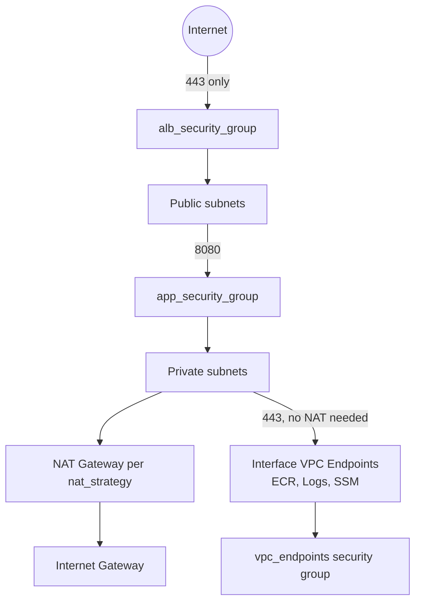

# Lab 8: AWS Networking Platform

## Objective
Compose the shared `vpc` and `security-groups` modules (built in [Lab 4](../lab-04-module-design/)) into a complete, layered networking platform — public/private subnets, NAT strategy, tiered security groups, and Interface VPC endpoints — and use it to reason concretely about availability, cost, and security trade-offs rather than abstractly.

## Scenario
You're building the shared networking foundation a platform team would hand to every application team in an organization: an ALB-facing public tier, a private application tier with no direct internet ingress, and private-subnet instances that need to be reachable for operational access without opening SSH to the internet or running a bastion host.

## Skills Practised
- Composing existing modules at a root level (not building new module internals)
- NAT gateway strategy trade-offs (`none` / `single` / `per_az`)
- Tiered security group design (public ALB tier vs. private app tier vs. VPC-endpoint tier)
- Interface vs. Gateway VPC endpoints, and the SSM-Session-Manager-instead-of-bastion pattern
- Reasoning explicitly about availability, cost, and security trade-offs for a real design

## Architecture

Note there is deliberately **no bastion host** in this diagram — the SSM/SSMMessages/EC2Messages Interface endpoints let an operator reach a private-subnet instance via `aws ssm start-session`, with no open inbound port anywhere and no standing bastion instance to patch/monitor.

## Prerequisites
- [Lab 2](../lab-02-remote-state/) (remote backend) and [Lab 4](../lab-04-module-design/) (the `vpc`/`security-groups` modules) completed
- AWS credentials with VPC, EC2, and VPC endpoint permissions

## Directory Structure
```text
lab-08-aws-networking/
├── README.md
├── versions.tf
├── variables.tf
├── main.tf
├── outputs.tf
├── backend.hcl.example
└── terraform.tfvars.example
```

## Step-by-Step Tasks
1. Copy `backend.hcl.example` → `backend.hcl` and `terraform.tfvars.example` → `terraform.tfvars`, filling in Lab 2's bucket/table names.
2. `terraform init -backend-config=backend.hcl`
3. `terraform plan` with `nat_strategy = "none"` first — observe zero NAT gateways, and note the private app tier would have **no internet egress at all** (fine for an app that only talks to VPC-internal/endpoint-reachable services, broken for anything needing arbitrary outbound internet access).
4. Change to `nat_strategy = "single"` and re-plan — observe exactly one NAT gateway regardless of AZ count.
5. Change to `nat_strategy = "per_az"` and re-plan — observe one NAT gateway per AZ.
6. Apply with `nat_strategy = "single"` (the cost-conscious default for this lab).
7. Confirm the six Interface endpoints (`ecr.api`, `ecr.dkr`, `logs`, `ssm`, `ssmmessages`, `ec2messages`) were created.

## Terraform Configuration
See [`main.tf`](main.tf) for the full module composition and Interface endpoint configuration.

## Commands to Execute
```bash
cp backend.hcl.example backend.hcl && cp terraform.tfvars.example terraform.tfvars
# edit both files with Lab 2's actual bucket/table names
terraform init -backend-config=backend.hcl
terraform plan -var="nat_strategy=none"
terraform plan -var="nat_strategy=per_az"
terraform apply   # uses nat_strategy=single from terraform.tfvars
```

## Expected Output
With `nat_strategy = "single"` and 2 AZs: 1 VPC, 1 IGW, 2 public subnets, 2 private subnets, 1 NAT gateway + 1 EIP, 2 security groups (ALB, app), 1 VPC-endpoints security group, 6 Interface VPC endpoints, 1 S3 Gateway endpoint (from the `vpc` module's default).

## Validation
```bash
# Confirm the app tier truly has no route to the internet gateway directly
aws ec2 describe-route-tables --route-table-ids "$(terraform output -json private_subnet_ids | jq -r '.[0]')" \
  --query 'RouteTables[0].Routes'
# Should show a route via the NAT gateway, never a direct igw-* route.

# Confirm the ALB security group is the ONLY one with a 0.0.0.0/0 ingress rule
aws ec2 describe-security-groups --group-ids "$(terraform output -raw app_security_group_id)" \
  --query 'SecurityGroups[0].IpPermissions'
# Should show only the VPC-CIDR-scoped rule - no 0.0.0.0/0 anywhere.
```

## Failure Injection
Attempt to add a `0.0.0.0/0` ingress rule to `app_security_group` without the `allow_public` flag:
```hcl
# In main.tf, temporarily add to module.app_security_group's ingress_rules:
"bad_rule" = {
  from_port   = 22
  to_port     = 22
  protocol    = "tcp"
  cidr_blocks = ["0.0.0.0/0"]
}
```
Expected: `terraform plan` fails at the `security-groups` module's `validation` block before any AWS API call — proving the guard from [Question 2](../../interview-questions/01-terraform-core.md#question-2-the-security-group-nobody-could-safely-resize) works exactly as designed.

## Troubleshooting Exercise
Set `enable_interface_endpoints = false` and re-apply. Then try to reach an instance in the private subnet via SSM — it will fail, since the SSM endpoints no longer exist and the instance's private subnet has no other path to the SSM service (unless a NAT gateway happens to also be present, in which case it would work via the internet instead — a good discussion point: Interface endpoints aren't the *only* way to reach SSM, but they're the way that works with `nat_strategy = "none"` and keeps traffic off the public internet even when NAT is present).

## Cleanup
```bash
terraform destroy
```
**Chargeable resources:** the NAT gateway (hourly + data processing charges — the dominant cost in this lab), the Elastic IP (free while attached to a running NAT gateway, billed if left unattached), and the Interface VPC endpoints (small hourly charge each, six of them). **Verify current AWS pricing yourself** before leaving this running for any extended period; destroy promptly after completing the exercises.

## Interview Questions Connected to This Lab
- [Question 44: The mesh nobody could keep in their head](../../interview-questions/05-aws-architecture.md#question-44-the-mesh-nobody-could-keep-in-their-head) — connectivity architecture at scale
- [Question 47: The NAT gateway bill nobody explained](../../interview-questions/05-aws-architecture.md#question-47-the-nat-gateway-bill-nobody-explained) — cost investigation
- [Question 50: Trading NAT gateways for VPC endpoints](../../interview-questions/05-aws-architecture.md#question-50-trading-nat-gateways-for-vpc-endpoints) — the exact trade-off this lab implements
- [Question 57: Three security groups, one cluster, one incident waiting to happen](../../interview-questions/06-kubernetes-eks.md#question-57-three-security-groups-one-cluster-one-incident-waiting-to-happen) — tiered security group design, extended for EKS in Lab 9

## Production Considerations
- A real production platform would likely also need a Network Firewall or third-party egress-filtering appliance for compliance-sensitive workloads — out of scope here, but worth knowing exists.
- This lab's ALB security group is the only intentionally-public-facing piece; in a real platform, this exact configuration is exactly what a policy-as-code rule (see [Lab 13](../lab-13-policy-as-code/)) should allow while blocking the same pattern anywhere else.
- At real organizational scale, this VPC/security-group pair becomes the `foundation` layer referenced throughout [`terraform-architecture.md`](../../docs/terraform-architecture.md#7-layered-deployment-architecture) — consumed by application teams via the SSM-parameter pattern, not a shared state reference.

## Advanced Challenge
Add a Kubernetes-style three-tier security group model (cluster / node / pod, per [Question 57](../../interview-questions/06-kubernetes-eks.md#question-57-three-security-groups-one-cluster-one-incident-waiting-to-happen)) in preparation for [Lab 9](../lab-09-eks-infrastructure/), and add a `aws_flow_log` resource capturing VPC Flow Logs to a CloudWatch Logs group, so you have real traffic visibility to validate the "app tier has no direct internet path" claim empirically rather than just by reading route tables.
