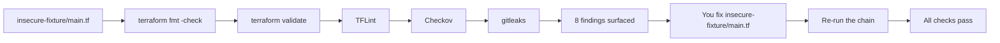

# Lab 10: Terraform Security Pipeline

## Objective
Build and run a complete static-validation chain (`fmt`, `validate`, TFLint, Checkov, secret scanning) against a deliberately insecure configuration, find every planted finding using the tools' own output — not the answer key — and fix them.

## Scenario
A new team's Terraform configuration ([`insecure-fixture/main.tf`](insecure-fixture/main.tf)) needs to pass your organization's security gate before merge. Eight distinct findings are planted in it. Your job is to run the same validation chain a real CI pipeline would run, read the output, and fix every finding — then compare against [`corrected-fixture/main.tf`](corrected-fixture/main.tf) only after you've made a genuine attempt.

## Skills Practised
- Running `terraform fmt`, `terraform validate`, TFLint, Checkov, and a secret scanner (gitleaks) in sequence
- Reading and acting on static analysis findings without guidance
- Distinguishing lint issues (style/correctness) from security issues (misconfiguration) from secrets (credential exposure)
- Fixing public S3 exposure, security group over-exposure, missing encryption, hardcoded credentials, missing mandatory tags, and oversized instance types

## Architecture


## Prerequisites
- Terraform >= 1.7
- [TFLint](https://github.com/terraform-linters/tflint) installed
- [Checkov](https://www.checkov.io/) installed (`pip install checkov` or the container image)
- [gitleaks](https://github.com/gitleaks/gitleaks) installed
- No prior lab dependency — this lab is self-contained and creates no real AWS resources at all (the fixture is never applied)

## Directory Structure
```text
lab-10-security-validation/
├── README.md
├── .tflint.hcl
├── insecure-fixture/
│   └── main.tf        # 8 planted findings - work here
├── corrected-fixture/
│   └── main.tf        # the answer key - don't peek early
└── scripts/
    └── run-security-checks.sh
```

## Step-by-Step Tasks
1. Run `./scripts/run-security-checks.sh insecure-fixture` and read every finding reported.
2. For each finding, identify: which tool caught it, what category it is (lint/security/secret), and what the fix should be — **without looking at `corrected-fixture/`** yet.
3. Edit `insecure-fixture/main.tf` directly, fixing findings one at a time, re-running the script after each fix.
4. Once the script reports "All checks passed," diff your fixed version against `corrected-fixture/main.tf` to compare your approach.
5. Read the inline `# FINDING N` comments in the original `insecure-fixture/main.tf` (via git history/backup, or the corrected file's `# FIX N` comments) to confirm you caught all 8.

## Terraform Configuration
[`insecure-fixture/main.tf`](insecure-fixture/main.tf) (the exercise) and [`corrected-fixture/main.tf`](corrected-fixture/main.tf) (the answer key).

## Commands to Execute
```bash
chmod +x scripts/run-security-checks.sh
./scripts/run-security-checks.sh insecure-fixture
# ... fix findings iteratively ...
./scripts/run-security-checks.sh insecure-fixture   # re-run until clean
diff insecure-fixture/main.tf corrected-fixture/main.tf
```

## Expected Output
Initial run: `terraform fmt` may pass or fail depending on formatting; `checkov` reports multiple `FAILED` checks for the public S3 policy, missing encryption, public RDS, hardcoded password, and the open security group; `gitleaks` reports a finding for the hardcoded `access_key`/`secret_key`. After fixes: every check reports success/pass with zero findings.

## Validation
The validation *is* the exercise — a clean run of `./scripts/run-security-checks.sh insecure-fixture` with zero findings across all five tools is the proof your fixes are complete and correct.

## Failure Injection
After fixing everything, deliberately reintroduce **one** finding at a time (e.g., set `storage_encrypted = false` again) and re-run the script — confirm Checkov specifically catches that one regression, proving your understanding of which tool catches which class of issue rather than just matching the answer key by rote.

## Troubleshooting Exercise
Add a `#checkov:skip=CKV_AWS_16:not needed for this demo` comment above `aws_db_instance.app`'s (still-encrypted) block and re-run — confirm Checkov now shows it as skipped rather than passed. Then read [Question 61](../../interview-questions/07-security.md#question-61-the-finding-that-got-a-skip-comment-instead-of-a-fix) and explain, in your own words, why an unreviewed skip comment like this is a governance gap even though the check technically "passes" the pipeline.

## Cleanup
No cleanup needed — this lab never runs `terraform apply` and creates no real AWS resources. If you did experiment with `terraform apply` against the fixture (strongly discouraged, since several placeholder values like `vpc-placeholder` and `ami-placeholder` are not real IDs and would fail), run `terraform destroy` and verify via the AWS console that nothing was left behind.

## Interview Questions Connected to This Lab
- [Question 33: The module that let you forget encryption](../../interview-questions/03-modules.md#question-33-the-module-that-let-you-forget-encryption)
- [Question 40: The access key in the provider block](../../interview-questions/04-providers.md#question-40-the-access-key-in-the-provider-block)
- [Question 61: The finding that got a skip comment instead of a fix](../../interview-questions/07-security.md#question-61-the-finding-that-got-a-skip-comment-instead-of-a-fix)
- [Question 65: Auditing sixty accounts for one bad habit](../../interview-questions/07-security.md#question-65-auditing-sixty-accounts-for-one-bad-habit)
- [Question 112: The instance type nobody could justify](../../interview-questions/13-governance.md#question-112-the-instance-type-nobody-could-justify)

## Production Considerations
- A real pipeline runs this exact chain automatically on every PR (see [Lab 12](../lab-12-cicd-pipeline/)) — this lab's manual script is a learning tool, not the production pattern.
- Checkov's default rule set is broad; real organizations typically tune which checks are mandatory-blocking versus advisory, and require a reviewed, expiring justification for any suppression (see [Question 61](../../interview-questions/07-security.md#question-61-the-finding-that-got-a-skip-comment-instead-of-a-fix) and [Question 113](../../interview-questions/13-governance.md#question-113-the-exception-that-had-no-expiration-date)).
- Static scanning catches *generic* misconfigurations; org-*specific* rules (mandatory tags, approved regions, approved instance sizes) belong in policy-as-code (see [Lab 13](../lab-13-policy-as-code/)), not just a static scanner's default rule set.

## Advanced Challenge
Add a ninth, more subtle finding of your own design (e.g., an IAM policy statement using `"Action": "*"` on `"Resource": "*"`) to a fresh copy of the insecure fixture, without telling a colleague what you added, and have them find it using only the tool chain's output — the real test of whether this validation chain is actually thorough, not just whether you can find findings you already know are there.
