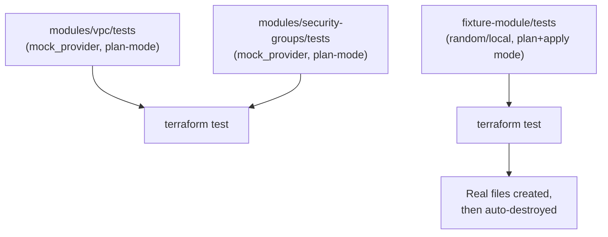

# Lab 11: Native Terraform Testing

## Objective
Write and run a complete `terraform test` suite for a module — covering valid configuration, invalid input rejection, resource attribute assertions, and a genuine `apply`-mode test with guaranteed cleanup — then prove your tests actually test something via a deliberate mutation-testing exercise.

## Scenario
You've inherited three modules with differing test maturity: `modules/vpc` and `modules/security-groups` (built in [Lab 4](../lab-04-module-design/), already well-tested with `mock_provider`, entirely plan-mode) and this lab's own `fixture-module` (a trivial, zero-cost module using only the `random`/`local` providers, specifically built so you can run genuine `apply`-mode tests with zero AWS cost or credentials required). Your job is to run all of them, understand why plan-mode and apply-mode tests each exist, and prove — via mutation testing — that your assertions would actually catch a real bug.

## Skills Practised
- `terraform test` with `command = plan` and `command = apply`
- `mock_provider` for zero-cost, zero-credential unit testing
- `expect_failures` for testing `validation` blocks
- Writing assertions against independently-derived expected values, not tautological self-comparisons
- Mutation testing: deliberately breaking logic to prove a test suite would catch it

## Architecture


## Prerequisites
- [Lab 4](../lab-04-module-design/) completed (for `modules/vpc`/`modules/security-groups` context)
- Terraform >= 1.7 with `terraform test` and `mock_provider` support (verify against your installed version)
- No AWS credentials needed for this entire lab — every test here is either mocked or uses only the `random`/`local` providers

## Directory Structure
```text
lab-11-testing/
├── README.md
└── fixture-module/
    ├── versions.tf, variables.tf, main.tf, outputs.tf
    ├── .gitignore
    └── tests/
        └── fixture_module.tftest.hcl

modules/vpc/tests/vpc_basic.tftest.hcl                       # from Lab 4
modules/security-groups/tests/security_groups_basic.tftest.hcl  # from Lab 4
```

## Step-by-Step Tasks
1. Run `terraform test` inside `modules/vpc/` and `modules/security-groups/` — read every `run` block in the `.tftest.hcl` files first, then confirm all pass.
2. Run `terraform test` inside `fixture-module/` — note the `apply`-mode run actually creates `fixture-module/output/<pet-name>.json` and then Terraform automatically destroys it as part of the same test run.
3. **Mutation testing exercise**: temporarily edit `modules/security-groups/variables.tf`'s `ingress_rules` validation condition to introduce a bug — e.g., change `r.allow_public || !contains(r.cidr_blocks, "0.0.0.0/0")` to always evaluate `true` (e.g., `true || ...`). Re-run `terraform test` in `modules/security-groups/` and confirm the `public_cidr_without_allow_public_is_rejected` test now **fails to fail** — i.e., it reports a test failure because the plan unexpectedly succeeded where `expect_failures` said it shouldn't. This is the concrete proof the test suite would have caught this exact class of bug (see [Question 79](../../interview-questions/09-testing.md#question-79-the-validation-block-nobody-proved-actually-validates)). **Revert your edit before continuing.**
4. Deliberately write a tautological (broken) assertion in a scratch copy of `fixture-module/tests/fixture_module.tftest.hcl` — change the apply-mode assertion to compare `jsondecode(file(...)).environment == var.environment` instead of the literal `"dev"` — and discuss with a peer (or yourself, in writing) why this version would still pass even if the module silently used the wrong value somewhere else in a more complex scenario, per [Question 83](../../interview-questions/09-testing.md#question-83-the-test-suite-that-couldnt-fail).

## Terraform Configuration
See [`fixture-module/`](fixture-module/) for the zero-cost apply-mode-testable module, and [`modules/vpc/tests/`](../../modules/vpc/tests/) / [`modules/security-groups/tests/`](../../modules/security-groups/tests/) for the plan-mode/`mock_provider` examples from Lab 4.

## Commands to Execute
```bash
cd modules/vpc && terraform test && cd -
cd modules/security-groups && terraform test && cd -
cd labs/lab-11-testing/fixture-module && terraform init && terraform test && cd -
```

## Expected Output
All three `terraform test` runs report every `run` block as `pass`. The `fixture-module` apply-mode run additionally shows Terraform creating and then destroying the `random_pet` and `local_file` resources within the single test invocation.

## Validation
```bash
# Confirm the apply-mode test genuinely cleaned up - no leftover output files
ls labs/lab-11-testing/fixture-module/output/ 2>/dev/null && echo "LEFTOVER FILES - cleanup failed" || echo "Clean - no leftover files, as expected"
```

## Failure Injection
Complete Step 3 above (the mutation-testing exercise on `modules/security-groups`) — this *is* the failure-injection exercise for this lab, deliberately designed to prove test efficacy rather than just demonstrate a passing suite.

## Troubleshooting Exercise
Break `fixture-module/main.tf` by renaming `random_pet.workload_name` to `random_pet.name` without updating `local_file.report`'s reference to it, and run `terraform test`. Read the resulting error message carefully — it should be a normal Terraform reference error (undefined resource), not a test-framework-specific error, since `terraform test` runs the exact same configuration-parsing and graph-construction logic as `plan`/`apply`. Revert once you've confirmed this.

## Cleanup
No AWS cleanup needed anywhere in this lab. For the fixture module, confirm no `output/*.json` files remain after test runs (per the Validation step above) — if any do, that indicates a test file that errored badly enough to skip its own cleanup, worth investigating per [Question 80](../../interview-questions/09-testing.md#question-80-the-test-that-left-the-lights-on).

## Interview Questions Connected to This Lab
- [Question 79: The validation block nobody proved actually validates](../../interview-questions/09-testing.md#question-79-the-validation-block-nobody-proved-actually-validates)
- [Question 80: The test that left the lights on](../../interview-questions/09-testing.md#question-80-the-test-that-left-the-lights-on)
- [Question 81: Choosing the right tool for "does this actually work"](../../interview-questions/09-testing.md#question-81-choosing-the-right-tool-for-does-this-actually-work)
- [Question 83: The test suite that couldn't fail](../../interview-questions/09-testing.md#question-83-the-test-suite-that-couldnt-fail)
- [Question 86: The test suite frozen in time](../../interview-questions/09-testing.md#question-86-the-test-suite-frozen-in-time)

## Production Considerations
- Real integration tests against genuine AWS resources need the cost-controlled sandbox and scheduled-sweep cleanup pattern from [Question 80](../../interview-questions/09-testing.md#question-80-the-test-that-left-the-lights-on) — this lab's zero-cost `random`/`local` fixture sidesteps that entirely, which is exactly why it's a teaching tool, not a template for testing real AWS-provisioning modules.
- A CI gate requiring "all tests pass" is necessary but not sufficient — see [Question 86](../../interview-questions/09-testing.md#question-86-the-test-suite-frozen-in-time) on why new module features need a structural check ensuring they get their own test coverage, not just a passing existing suite.

## Advanced Challenge
Write a genuine Terratest-based (Go) test asserting real HTTP-level behavior against a small, cheap, real AWS resource (e.g., an S3 static website or a Lambda function URL) with guaranteed `defer terraform.Destroy(...)` cleanup immediately after apply — per [Question 81](../../interview-questions/09-testing.md#question-81-choosing-the-right-tool-for-does-this-actually-work), demonstrating the specific capability gap (real HTTP assertions) that native `terraform test` cannot fill.
