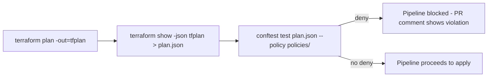

# Lab 13: Policy as Code

## Objective
Write and test OPA/Rego policies enforcing organization-specific rules — no public S3 buckets, no unrestricted security groups, mandatory encryption, mandatory tags, sizing limits outside production, and approved regions only — evaluated against real `terraform show -json` plan output via Conftest.

## Scenario
Static scanners (Checkov, from [Lab 10](../lab-10-security-validation/)) catch generic misconfigurations. Your organization needs its *own specific* rules enforced as a mandatory, testable pipeline gate: exactly the rules a generic scanner has no way to know about (your specific tag schema, your specific approved regions, your specific size limits per environment).

## Skills Practised
- Writing Rego `deny` rules against Terraform plan JSON structure
- Testing policies themselves with `opa test` (both denying and passing fixture cases)
- Wiring Conftest into a CI pipeline as a plan-review gate (already referenced in [Lab 12](../lab-12-cicd-pipeline/)'s workflow)
- Designing a reviewed, expiring exception mechanism rather than an unenforced escape hatch

## Architecture


## Prerequisites
- [Conftest](https://www.conftest.dev/) and/or the [OPA CLI](https://www.openpolicyagent.org/) installed (`opa test` is used for the policy test suite itself)
- Terraform >= 1.7
- No AWS credentials needed — every exercise in this lab operates on JSON fixtures, never a real cloud account

## Directory Structure
```text
policies/
├── public_exposure.rego       # public S3 buckets, open database ports
├── encryption.rego             # unencrypted S3/RDS/EBS, hardcoded RDS passwords
├── mandatory_tags.rego         # Environment + ManagedBy required on every taggable resource
├── instance_sizing.rego        # oversized instance types outside production
├── approved_regions.rego       # provider region allowlist
└── tests/
    ├── public_exposure_test.rego
    ├── encryption_test.rego
    ├── mandatory_tags_test.rego
    └── instance_sizing_test.rego
```

## Step-by-Step Tasks
1. Run `opa test policies/ -v` and read every test — note each policy file has both a denying-case test and an allowing-case test, per the discipline in [Question 82](../../interview-questions/09-testing.md#question-82-testing-the-tests-that-test-your-infrastructure).
2. Generate a real plan against [`labs/lab-10-security-validation/insecure-fixture`](../lab-10-security-validation/insecure-fixture/) (adjusting it to use placeholder-but-plannable values, or use `terraform plan` against any of this repository's real environments) and run `conftest test plan.json --policy policies/` against it — confirm it reports multiple violations matching the fixture's planted findings.
3. Fix the fixture (or use [`corrected-fixture/`](../lab-10-security-validation/corrected-fixture/)) and re-run — confirm zero violations.
4. **Mutation-testing exercise**: temporarily break `mandatory_tags.rego`'s condition (e.g., change `required_tags - {k | tags[k]}` to always evaluate to an empty set) and re-run `opa test` — confirm `test_denies_missing_tags` now fails, proving the test suite would catch this exact class of policy bug (see [Question 82](../../interview-questions/09-testing.md#question-82-testing-the-tests-that-test-your-infrastructure)). Revert before continuing.

## Terraform Configuration
This lab's deliverable is the `policies/` directory itself, evaluated against the plan JSON of any other lab's Terraform configuration — see [Lab 12](../lab-12-cicd-pipeline/)'s workflow for exactly where this fits into a real pipeline.

## Commands to Execute
```bash
opa test policies/ -v
cd environments/dev && terraform init -backend=false && terraform plan -out=tfplan && terraform show -json tfplan > /tmp/plan.json && cd -
conftest test /tmp/plan.json --policy policies/
```

## Expected Output
`opa test policies/ -v` reports every test as `PASS`. `conftest test` against a compliant environment plan reports `0 failures, 0 warnings`; against the Lab 10 insecure fixture's equivalent plan, it reports multiple named failures, one per planted finding the relevant policy covers.

## Validation
The `opa test` run itself is the validation for the policies; the `conftest test` run against a real plan is the validation for the pipeline integration.

## Failure Injection
Add a new, deliberately-wrong Rego rule (e.g., one with an always-true condition that would block every plan regardless of content) to a scratch copy of `policies/`, run `conftest test` against a known-good plan, and confirm it now incorrectly blocks it — then write the corresponding `opa test` fixture case that would have caught this mistake before it ever reached a real pipeline.

## Troubleshooting Exercise
Add a `SizeExceptionTicket` tag to an oversized instance in a test plan fixture and confirm `instance_sizing.rego` correctly allows it through — then remove the tag and confirm it's denied again. This exercises the reviewed-exception pattern from [Question 113](../../interview-questions/13-governance.md#question-113-the-exception-that-had-no-expiration-date) — discuss with a peer how you'd add expiration-date enforcement to this exception mechanism (the interview question's full answer covers exactly this).

## Cleanup
No AWS resources are created by this lab. Delete any scratch `/tmp/plan.json` files generated during the exercises.

## Interview Questions Connected to This Lab
- [Question 65: Auditing sixty accounts for one bad habit](../../interview-questions/07-security.md#question-65-auditing-sixty-accounts-for-one-bad-habit)
- [Question 67: Choosing a policy engine before you have a platform for it](../../interview-questions/07-security.md#question-67-choosing-a-policy-engine-before-you-have-a-platform-for-it)
- [Question 82: Testing the tests that test your infrastructure](../../interview-questions/09-testing.md#question-82-testing-the-tests-that-test-your-infrastructure)
- [Question 111: Tags that were supposed to be mandatory](../../interview-questions/13-governance.md#question-111-tags-that-were-supposed-to-be-mandatory)
- [Question 112: The instance type nobody could justify](../../interview-questions/13-governance.md#question-112-the-instance-type-nobody-could-justify)
- [Question 113: The exception that had no expiration date](../../interview-questions/13-governance.md#question-113-the-exception-that-had-no-expiration-date)

## Production Considerations
- `approved_regions.rego` relies on the plan JSON's `configuration.provider_config` structure — verify this field's exact shape against your installed Terraform version before relying on it in a real pipeline; plan JSON schema details can shift across versions.
- These policies only catch Terraform-originated changes — a manually-created public S3 bucket in the console is invisible to this entire pipeline; pair with an AWS Config rule (per [Question 65](../../interview-questions/07-security.md#question-65-auditing-sixty-accounts-for-one-bad-habit)) as a continuous, Terraform-independent backstop.
- Add the expiration-enforcement pattern from [Question 113](../../interview-questions/13-governance.md#question-113-the-exception-that-had-no-expiration-date) to `instance_sizing.rego`'s exception mechanism before relying on it in a real organization — this lab's version has no expiration check yet, deliberately left as the Advanced Challenge below.

## Advanced Challenge
Add expiration-date enforcement to the `SizeExceptionTicket` exception mechanism: require a companion `SizeExceptionExpiresOn` tag, and add a new `deny` rule (with its own `opa test` fixture, both a not-yet-expired-passes case and an expired-denies case) rejecting any exception whose expiration date has passed — implementing the full pattern from [Question 113](../../interview-questions/13-governance.md#question-113-the-exception-that-had-no-expiration-date) rather than just referencing it.
