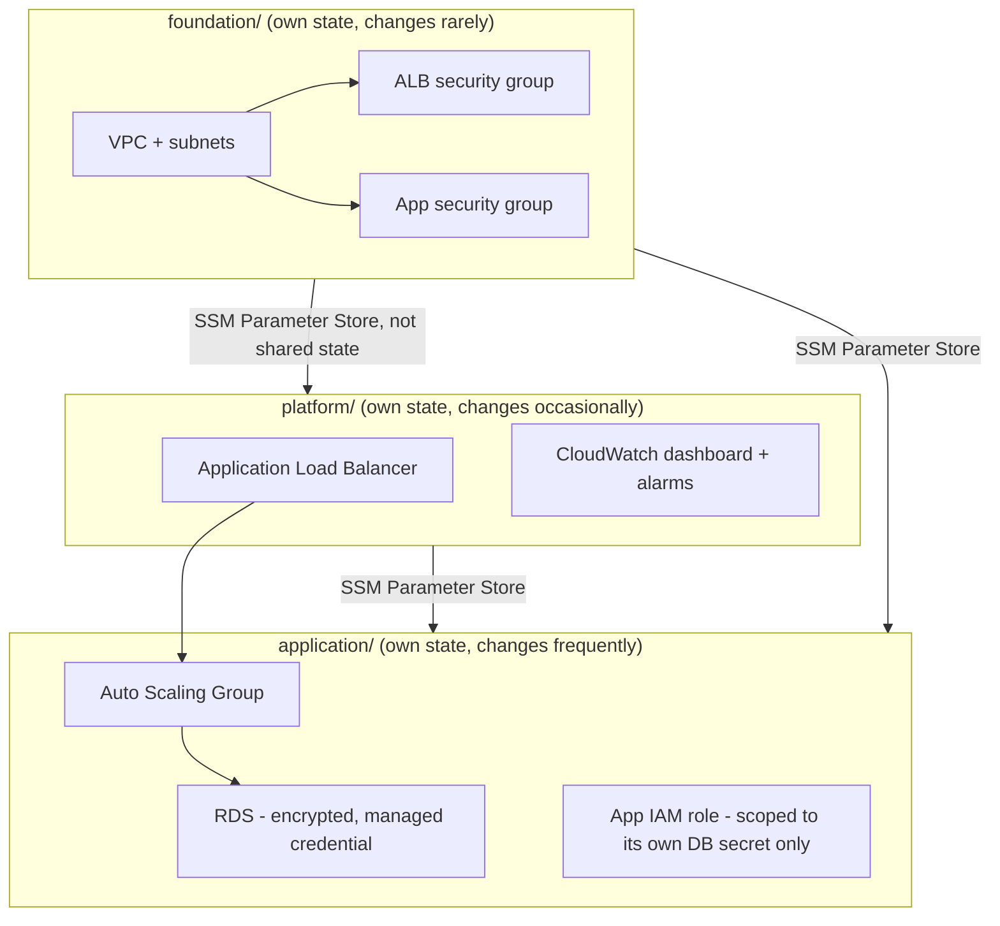

# Capstone Operational Documentation

This is the operational reference for the three-tier platform this capstone builds: `foundation` (networking), `platform` (ALB + observability), `application` (RDS + compute). It exists so a new on-call engineer can operate this platform without needing to read the full lab narrative first.

## Architecture summary

## Why three states, not one
Per [`docs/terraform-architecture.md` §7](../../docs/terraform-architecture.md#7-layered-deployment-architecture): `foundation` changes rarely and is highest-blast-radius if wrong (it's the networking every other layer depends on); `platform` changes occasionally; `application` changes most frequently (new app versions, scaling adjustments, database tuning) and should never be blocked behind or able to accidentally affect the other two layers' state/locks. Cross-layer values flow through SSM Parameter Store, never `terraform_remote_state` — see [Question 16](../../interview-questions/02-state-management.md#question-16-the-outage-that-started-in-someone-elses-state) for why that coupling is specifically avoided.

## Deployment order
`foundation` → `platform` → `application`, always. Each layer's `terraform.tfvars` sets the same `environment` value so their SSM parameter paths (`/capstone/<environment>/...`) line up correctly.

## High availability
- VPC spans 3 AZs in production (2 in dev/staging — see each layer's `terraform.tfvars.example`).
- `nat_strategy = "per_az"` in production (one NAT gateway per AZ — no single point of failure for egress).
- RDS `multi_az = true` in production (synchronous standby in a second AZ — automatic failover in ~60-120 seconds on an AZ-level failure).
- ASG spans all private subnets/AZs with `min_size = 2`.
- **This is HA within a region, not disaster recovery across regions** — see [Question 103](../../interview-questions/11-ha-dr.md#question-103-multi-az-isnt-multi-region). A full regional outage is not covered by anything in this capstone as built; see the Disaster Recovery section below for what would need to be added.

## Security posture
- No hardcoded credentials anywhere — RDS uses `manage_master_user_password`; the app IAM role reads it via Secrets Manager at boot.
- The ALB security group is the **only** security group in this platform with any `0.0.0.0/0` ingress rule, and it's on 443/80 only.
- The app tier has no direct internet ingress; the RDS security group accepts connections only from the app tier's security group, never a CIDR range.
- Every taggable resource carries an `Environment` tag; extend with `CostCenter`/`Owner` per your organization's actual tagging schema (see [Lab 13](../lab-13-policy-as-code/)'s `mandatory_tags.rego` for enforcement).

## Cost considerations
**Chargeable resources in this capstone, by layer:**
- `foundation`: NAT gateway(s) — the dominant recurring cost. `per_az` in production means one per AZ (3 in the example tfvars).
- `platform`: ALB (hourly + LCU charges), CloudWatch alarms/dashboard (minimal).
- `application`: RDS instance (hourly + storage, doubled if `multi_az = true`), EC2 instances in the ASG (hourly, `desired_capacity` × `instance_type`).

**Verify current AWS pricing yourself** before applying any environment beyond a brief `dev` exercise — this capstone is explicitly not free-tier-friendly for `production`-shaped settings (3 NAT gateways + Multi-AZ RDS + 2+ EC2 instances is real, ongoing cost). See each layer's lab README section for a cost-conscious `dev` alternative (fewer AZs, `nat_strategy = "single"` or `"none"`, `multi_az = false`, `desired_capacity = 1`).

## Disaster recovery design (as currently built vs. what would be needed)
**As built:** this capstone implements HA within one region only (see above). It does **not** implement cross-region DR.

**What a genuine DR extension would require**, per [`docs/ha-dr.md`](../../docs/ha-dr.md):
1. Deploy the same three layers (`foundation`, `platform`, `application`) to a second region, parameterized by region exactly like [Diagram 9](../../diagrams/09-multi-region.md) — the module set doesn't change, only the `aws_region`/provider configuration and `terraform.tfvars`.
2. Choose a DR tier (see [Question 99](../../interview-questions/11-ha-dr.md#question-99-picking-a-dr-strategy-before-picking-a-dr-budget)) based on actual business RTO/RPO requirements for whatever this platform serves — this capstone doesn't prescribe one, since that's a business decision, not a technical default.
3. Add cross-region data replication for the RDS layer (a cross-region read replica, promoted during failover) — the specific mechanism and its failback complexity are covered in [Question 102](../../interview-questions/11-ha-dr.md#question-102-the-failback-that-found-two-versions-of-the-truth).
4. **Replicate the state backend itself cross-region** (S3 Cross-Region Replication on the bucket from [Lab 2](../lab-02-remote-state/)) — see [Question 101](../../interview-questions/11-ha-dr.md#question-101-the-dr-plan-that-needed-terraform-which-needed-the-thing-that-just-went-down) for why this is the most commonly-missed piece of a DR design.
5. Run an actual failover drill before trusting any of the above — an undrilled DR plan is a hypothesis, not a capability (see [Question 100](../../interview-questions/11-ha-dr.md#question-100-the-drill-that-told-an-uncomfortable-truth)).

## Failure recovery quick reference
See [Lab 14](../lab-14-drift-and-recovery/)'s `recovery-runbook.md` for the full procedures. The most likely incidents specific to this capstone:
- **ASG instance refresh evicting too many instances at once**: the `instance_refresh` block's `min_healthy_percentage = 90` and `checkpoint_delay = 300` are deliberately conservative — see [Question 55](../../interview-questions/06-kubernetes-eks.md#question-55-the-node-group-upgrade-that-evicted-everything-at-once) (written for EKS, the same principle applies to a plain ASG).
- **RDS decommission needed**: `deletion_protection = true` in production requires the two-step process from [Question 3](../../interview-questions/01-terraform-core.md#question-3-decommissioning-a-prevent_destroy-protected-resource).
- **Cross-layer SSM parameter missing/wrong**: confirm `foundation`/`platform` were applied (in that order) before `application`, and confirm all three layers' `terraform.tfvars` use the identical `environment` value.

## Environment promotion
Promote a change from `dev` → `staging` → `production` by changing the *version pin* or *configuration value* (never by copy-pasting resources) in each environment's `terraform.tfvars`, following exactly the pattern established in [Lab 5](../lab-05-multi-environment/) and [Diagram 10](../../diagrams/10-multi-environment-repo.md).
